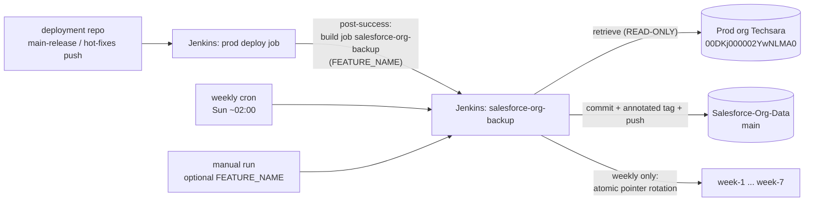

# Backup Pipeline Architecture

Automated, read-only backup of the Techsara production Salesforce org's metadata into
this git repo, with a rolling 7-week branch window and permanent tagged restore points.

## The hard rule

> **Automation never writes to prod.** The pipeline runs only `sf org login`,
> `sf org display`, `sf project generate manifest --from-org`, and
> `sf project retrieve start`. Any deploy back to prod (rollback) is a manual,
> human-approved procedure — see [RUNBOOK-rollback.md](RUNBOOK-rollback.md).

## Flow



## Run types and what they produce

| Trigger | Detected as | Commit on `main` | Tag | Week rotation |
|---|---|---|---|---|
| Downstream of prod deploy | `deploy` | if org changed | `deploy/<date>-<feature>` | no |
| Weekly cron (Sun ~02:00) | `weekly` | if org changed | `snapshot/<date>` | yes |
| Manual button | `manual` | if org changed | `deploy/<date>-<feature-or-manual-run-N>` | no |

A tag is created **every** run, even when nothing changed — the tag list is the complete
audit trail of "when did we verify prod state".

## Week-branch rotation (no merges — pointer moves)

`main`'s history is linear, so `week-N` branches are just pointers into it:

```
main:    A──B──C──D──E──F──G──H   <- latest prod
week-1 ─────────────────────► G   (~1 week ago)
week-2 ─────────────────────► F   (~2 weeks ago)
  ...
week-7 ─────────────────────► A   (~7 weeks ago)
```

Each weekly run: `week-7 <- week-6 <- ... <- week-2 <- week-1 <- main`, computed from
freshly fetched SHAs and applied as **one atomic `git push --force-with-lease`** —
all-or-nothing, and rejected if anyone moved a week branch mid-run. A
`rotation/<YYYY-Www>` marker tag makes the rotation idempotent (reruns in the same ISO
week no-op). Missing branches bootstrap to `main`, so the very first run creates all seven.

## Components

| File | Role |
|---|---|
| `Jenkinsfile` (repo root) | Pipeline: resolve run type → auth → snapshot → (weekly) rotate |
| `Prod Org Data/scripts/backup/snapshot.sh` | Full-org retrieve, warning classification, commit, tag, push |
| `Prod Org Data/scripts/backup/rotate-weeks.sh` | Atomic week-branch rotation |
| `Prod Org Data/scripts/backup/benign-warning-patterns.txt` | Regex allowlist of tolerated retrieve warnings |

### snapshot.sh safety mechanisms

- **Org identity check**: aborts unless the authenticated org is `00DKj000002YwNLMA0`.
- **Clean-slate retrieve**: `force-app/main/default` is wiped before retrieving, because
  `sf retrieve` only overlays files — this is how org-side *deletions* show up as git deletions.
- **Retry**: up to 3 retrieve attempts, tree fully reset between attempts so partial
  results never stack.
- **Warning classification**: the ~400 known-benign retrieve messages (system list views,
  `__hd` history fields, `WorkflowFlowAutomation` aliases, `UiViewDefinition`, LWR sites,
  one broken system dashboard/report) are tolerated via the pattern allowlist; anything
  else fails the build. Extend the allowlist file if Salesforce adds a new benign message.
- **Empty-retrieve guard**: fails if fewer than 1,000 files came down (full org is ~11k).
- **Mass-deletion guard**: fails if more than 200 files would be deleted, unless
  `ALLOW_MASS_DELETION=true` is passed after manual review — protects the mirror from a
  partial/broken retrieve masquerading as "everything got deleted in prod".
- Commits with `--no-verify` (+`HUSKY=0`) — repo hooks are dev tooling, not for CI.

## Credentials (Jenkins credential store)

| ID | Kind | Value | Rotation |
|---|---|---|---|
| `sf-prod-backup-auth-url` | Secret text | `result.sfdxAuthUrl` from `sf org display --target-org Techsara --verbose --json` | Re-run that command and update the secret whenever the refresh token is revoked (password reset, session revocation). |
| `github-backup-push` | Username + password | GitHub username + fine-grained PAT, Contents read/write on `Techsara-Solutions/Salesforce-Org-Data` only | Per GitHub PAT expiry. |

Alternative auth (deliberately **not** used): JWT bearer flow via the existing
`Production_Org_Read_only` external client app would avoid refresh-token expiry, but
requires uploading a certificate to the org — an org change, which this project avoids.
Revisit if auth-url rotation becomes annoying.

## Known gaps (what this backup does NOT contain)

- **Data/records** — this is a *metadata* backup only. Use Salesforce Data Export /
  Backup & Restore for record data.
- Two Experience Cloud sites on the "Build Your Own (LWR)" template — the Metadata API
  cannot export them.
- `UiViewDefinition` components (Salesforce reports the type unavailable to the API).
- Installed package internals (PandaDoc etc.) — only the installed-version markers.
- Secrets by design: connected-app consumer *secrets*, auth-provider secrets, certificate
  private keys are never exported by Salesforce (good — they don't belong in git).

## One-time setup checklist

1. Create both Jenkins credentials (table above).
2. Create pipeline job `salesforce-org-backup`: Pipeline script from SCM → this repo,
   branch `main`, script path `Jenkinsfile`. Git plugin: **full clone** (no shallow),
   **fetch tags**. Set the agent label in the Jenkinsfile (needs `sf` CLI v2+, git, bash).
3. Add the downstream trigger to the deploy pipeline (deployment repo), in
   `post { success { } }`:
   ```groovy
   build job: 'salesforce-org-backup', parameters: [string(name: 'FEATURE_NAME', value: env.FEATURE_NAME ?: env.BRANCH_NAME ?: '')], wait: false, propagate: false
   ```
   (`wait/propagate: false` = a backup hiccup never fails or delays a deploy. Replace
   `env.FEATURE_NAME` with whatever variable holds the release name in that pipeline.)
4. Smoke-test: manual run with `FEATURE_NAME=pipeline-smoke-test`, then a second run
   (expect green "No changes"), then a `RUN_TYPE=weekly` run (expect rotation + marker tag).
