# Internal-Interview Production Knowledge Base (AI Context / Model Brain Primer)

> **Purpose**: paste or reference this file at the start of an AI conversation to load the Internal Interview platform into working context. This is the **production-oriented edition**. The underlying technical snapshot was verified on **2026-08-12** using Salesforce describe metadata, Tooling `FieldDefinition`, SOQL counts, Tooling-API validation rules, retrieved live Flow XML, and Apex bodies. **Production must be treated as the final source of truth before any change or deployment.** Exact row counts, active versions, FLS visibility, IDs, and data snapshots can drift over time.

## How to use this doc / working rules

- **Target environment**: **prod**. Use the actual production `sf` alias configured on the machine; do not assume an alias or hostname. **Production metadata is the source of truth for production work.** The repository copies of the two large screen flows may be stale or divergent (see §4), so retrieve the current production member before editing or deployment.
- **Two DX projects, one org**:
  - `SalesforceFlows/` — this repo; flow-first internal-interview platform.
  - `TrainingModule/` (sibling dir, not a git repo) — Apex/LWC training platform + guest candidate portal; reuses interview objects for mocks.
- **Hard rules**: never `sf project deploy start` without explicit user confirmation. Always scope retrieves `-m Type:Name` (a broad retrieve once wiped 178 local files). Retrieve the target org's current copy before touching any shared object/flow. Never deploy the repository copies of `Internal_Interview_Conduct_Interview` or `Interview_Create_Reschedule_Flow` without a fresh prod retrieve and diff — the reference snapshot showed those repository copies were substantially older than the live implementations.
- **Flow XML editing**: element references are name-based (`<targetReference>`); renaming an element breaks every reference. Prefer Flow Builder + retrieve for non-trivial changes.

### Production provenance and truth hierarchy

This file is intentionally written for **production work**, but it distinguishes **structural knowledge** from **environment-specific observations**.

Use this truth order whenever sources disagree:

1. **Current production metadata and active automation** — retrieved directly from prod at the time of work.
2. **Current production data/schema evidence** — Tooling `FieldDefinition`, active Flow/Apex versions, validation rules, targeted SOQL.
3. **Fresh scoped retrieve into a clean working tree** — used to diff production against repositories.
4. **This knowledge-base document** — a high-value map and reasoning guide, but not a replacement for a fresh production retrieve.
5. **Repository copies** — useful history/implementation material, but some tracked flows/fields are known to be stale or incomplete.

**AI instruction:** never convert a historical count, FLS observation, active-version statement, or repo-vs-live difference into a claim about current prod unless it has been revalidated. For code/design reasoning, the object relationships and lifecycle described here are strong context; for deployment decisions, always require fresh prod evidence.


## Navigation / table of contents

- **0–6: Canonical source map** — subsystems, objects, question engine, lifecycle automation, integrations, repo/live differences, bugs, snapshot.
- **7: AI operating contract** — rules the model must follow.
- **8–9: Core mental model + lifecycle state machine** — business record vs meeting record; create/reschedule/cancel/complete.
- **10–12: Interview modes + question engine + worked reasoning examples**.
- **13–15: Resume, logs/evaluations, and training/mock subsystem**.
- **16–18: Integrations, invariants, and schema landmines**.
- **19–20: Production change safety + debugging matrix**.
- **21–23: Object glossary, component responsibility map, and impact-oriented known gaps**.
- **24–25: Production verification checklist + suggested system/context prompt**.
- **26–30: Fast invariants, terminology, scope boundaries, and maintenance rules**.

## 0. Big picture — three subsystems share the org

1. **Internal-interview platform** (SalesforceFlows, flow-first): schedule → Zoom callout → conduct → evaluate candidate interviews. Core objects: `Internal_Interview__c`, `Session__c`, `Resume__c` + question-bank config.
2. **Training platform + candidate portal** (TrainingModule, Apex/LWC): programs → enrollment (`Candidate_Training__c`) → steps/deliverables → AI grading (AWS Lambda) → **mock interviews that REUSE subsystem 1's objects and flows** (discriminator: `Internal_Interview__c.Candidate_Training__c` NOT NULL = mock). Guest Experience Cloud site `/AICPORTAL/s/`.
3. **Recruiting/staffing pipeline** (org-only, in neither repo): `Interview__c` (215+ custom fields, 508 rows), AI assignment flows, B2B submissions, QuickBooks, onboarding. Touches ours only via `Session__c.Interview__c` lookup + `Schedule_Session_From_Interview`.

People are modeled via **`Recruiter__c`**, not User: `Recruiter__c.Recruiter_User__c → User`, `.Email__c`, `.Slack_User_Id__c`. Every interviewer/host/attendee lookup on our objects points to Recruiter__c. Candidates = **Account** (custom `Email_replica__c` field), pre-conversion = **Lead**.

## 1. Object model

### 1a. ER diagram (core domain)

```mermaid
erDiagram
    Account ||--o{ Internal_Interview__c : "Candidate__c"
    Account ||--o{ Session__c : "Candidate__c"
    Account ||--o{ Resume__c : "Candidate__c"
    Lead ||--o{ Internal_Interview__c : "Lead__c"
    Lead ||--o{ Session__c : "Lead__c"
    Lead ||--o{ Resume__c : "Lead__c"
    Recruiter__c ||--o{ Internal_Interview__c : "Interviewer__c"
    Recruiter__c ||--o{ Session__c : "Host_User__c / Attendee_1/2"
    User ||--o{ Recruiter__c : "Recruiter_User__c"

    Internal_Interview__c ||--o{ Session__c : "Session__c.Internal_Interview__c (LK)"
    Session__c ||--o{ Internal_Interview__c : "II.Session__c (LK — mutual lookups, no MD)"
    Internal_Interview__c ||--o{ Resume__c : "Resume__c.Internal_Interview__c (LK)"
    Internal_Interview__c ||--o{ Internal_Interview__c : "Previous_internal_interview__c (self)"
    Internal_Interview__c ||--o{ Internal_Interview_Section_Log__c : "MD cascade"
    Internal_Interview__c ||--o{ Internal_Interview_Question_Log__c : "MD cascade"
    Internal_Interview__c ||--o{ Interview_Evaluation__c : "MD cascade"
    Interview_Evaluation__c ||--o{ Section_Evaluation__c : "MD cascade"
    Internal_Interview_Section_Log__c ||--o{ Internal_Interview_Question_Log__c : "LK"

    Interview_Type__c ||--o{ Internal_Interview__c : "Interview_Type__c"
    Niche__c ||--o{ Internal_Interview__c : "Niche__c / Hired_Niche__c"
    Template__c ||--o{ Internal_Interview__c : "Template__c"
    Template__c ||--o{ Template_Section__c : "MD cascade"
    Template_Section__c ||--o{ Template_Section_Question__c : "MD cascade"
    Template_Section_Question__c }o--|| Question_Bank__c : "Question__c (LK)"
    Template_Section__c }o--o| Section__c : "Section__c (LK, nillable!)"

    Section__c ||--o{ Section_Interview_Type__c : "MD"
    Interview_Type__c ||--o{ Section_Interview_Type__c : "MD (+Sequence__c)"
    Question_Bank__c ||--o{ Question_Section__c : "MD"
    Section__c ||--o{ Question_Section__c : "MD"
    Question_Bank__c ||--o{ Niche_Question__c : "MD"
    Niche__c ||--o{ Niche_Question__c : "MD"
    Question_Bank__c ||--o{ Question_Interview_Type__c : "MD"
    Interview_Type__c ||--o{ Question_Interview_Type__c : "MD"
    Question_Bank__c ||--o{ Question_Follow_Up__c : "MD"
    Section__c ||--o{ Question_Bank__c : "Section__c LK (feeds Section_Name__c formula)"

    Candidate_Training__c ||--o{ Internal_Interview__c : "Candidate_Training__c (mock flag)"
    Candidate_Training__c ||--o{ Session__c : "Candidate_Training__c"
    Session__c ||--o{ Session_Attendee__c : "MD"
```



### 1b. Lifecycle objects (reference snapshot dated 2026-08-12; re-check counts in prod)

| Object | Rows | Key relationships (API name → target, type) | Logic-driving fields |
|---|---|---|---|
| `Internal_Interview__c` | 307 | Session__c→Session (LK — mutual lookups with Session, no MD), Candidate__c→Account, Lead__c→Lead, Interviewer__c→**Recruiter__c**, Interview_Support_Person__c→Recruiter__c, Interview_Type__c, Niche__c, Hired_Niche__c→Niche, Template__c, Previous_internal_interview__c (self), Company__c, Candidate_Training__c→Candidate_Training__c (mock discriminator, FLS-hidden — see §1d), Triggered_By_Step__c→CandidateTrainingStep__c (FLS-hidden) | **64 custom fields true / 56 visible to CLI user (FLS)**. Status__c (Unscheduled/Scheduled/Rescheduled/Cancelled/Completed), Launch_mode__c (Techsara's Magic/Template), Has_Resume__c, Human_Decision__c (Hire/NoHire/Retake/Pass/Fail/Needs Improvement), AI_Decision__c, Final_Descion__c (sic), Mock_Status__c, Human_Total_Score__c, AI_Pregen_Status__c + AI_Pregenerated_Questions__c (source-snapshot/live-only relative to tracked repos; verify in prod), Selected_Time_Zone_Start_Tim__c (sic, picklist 96 slots)/Selected_Time_Zone_End_Time__c; mock set (FLS-hidden): Week_Number__c, Deadline__c, Is_Final_Week_Mock__c, Result_Reminder_Count__c, Last_Result_Reminder_At__c, Final_Decision_By__c |
| `Session__c` | 449 | Candidate__c→Account, Lead__c, Internal_Interview__c (LK), Host_User__c/Additional_Attendee_1__c/2__c→Recruiter__c, [training] Candidate_Training__c, Candidate_Training_Step__c, Cohort__c, Session_Window__c, Program_Version__c, Interview__c, Onboarding__c, Background_Check__c | Status__c (Unscheduled/Scheduled/Completed/Rescheduled/Cancelled), Purpose__c (Training/Internal Interview/…), Scheduled_Date__c (Date) + Selected_Time_Zone_Start_Time__c & Selected_Time_Zone_ETim__c (sic) (96-slot picklists — **no end-date field**), Meeting_Link__c, External_Meeting_ID__c/Passcode, calendar_event_id__c/link, Start/End_Time_IST__c, Actual_Start/End__c, Host_Feedback__c, FORMULAS (read-only): Candidate_Name__c, Candidate_Email__c, MeetingTopic__c |
| `Resume__c` | 73 | Candidate__c→Account (parent traversal `Candidate__r`; child rel on Account = `Resume__r`), Lead__c, Internal_Interview__c (LK; child rel on II = `Resume__r`), Uploaded_By__c/Approved_By__c→Recruiter__c, Niche__c | Is_Active__c (metadata default true; create-flow inserts explicit false, flips true after upload), Resume_Status__c (Draft/Under Review/Approved/Rejected/Uploaded); file itself = ContentDocumentLink on the Resume record |
| `Interview_Evaluation__c` | 11 | Internal_Interview__c **MD cascade**; Evaluator__c→Recruiter__c (confirmed in the source snapshot but FLS-hidden from the CLI user; verify production FLS) | Evaluation_Type__c (Human/AI), Decision__c, Total_Score__c |
| `Section_Evaluation__c` | 54 | Evaluation__c **MD cascade**, Section__c LK | Score__c, Comment__c |
| `Internal_Interview_Section_Log__c` | 73 | Internal_Interview__c **MD cascade**, Section__c LK | Sequence__c, Section_Score__c, Section_Comment__c, Question_Source_Used__c (Standard/AI Resume Based), Error_Log__c (source-snapshot/live-only relative to tracked repos; verify in prod) |
| `Internal_Interview_Question_Log__c` | 257 | Internal_Interview__c **MD cascade**, Internal_Interview_Section_Log__c LK, Section__c LK, Question_Bank__c LK | Question_Text__c, Sequence__c, Question_Source_Used__c; source-snapshot/live-only fields relative to tracked repos: Evalation_Criteria_log__c (sic), Follow_Ups_Log__c, Notebook_Link_Log__c, Scenario_Log__c |

Validation rules (live, active): `Session__c.Lock_Rescheduled_Session`, `Session__c.Require_Host_Feedback_On_Complete` (Completed requires Host_Feedback__c), `Internal_Interview__c.Lock_Rescheduled_Session` (`AND(NOT(ISNEW()), ISPICKVAL(PRIORVALUE(Status__c),"Rescheduled"))`). No record types anywhere (Master only).

### 1c. Config/content objects (question engine)

| Object | Rows | Notes |
|---|---|---|
| `Niche__c` | 18 | Domain_Type__c **[Tech; Non Tech]** (no hyphen!), Is_Active__c. Real niches: AI ML, Full Stack, Python, Rust Developer, Technical Product Manager (Tech); Product Manager, Finance Manager (Non Tech) |
| `Interview_Type__c` | 10 | Is_Active__c, Requires_Hired_Niche__c, Uses_Retake_Decision__c, Program_Version__c LK (unused). Types: Intake, Mock, OOT, Practice Mock Interview, Rejection Interview, Upcoming Interview, advance ai ml mock 1/final, +2 test |
| `Section__c` | 23 | Domain_Type__c **[Tech; Non-Tech; Both]** (hyphen! Apex normDomain() reconciles), Question_Source_Type__c [Standard; AI Resume Based], Total_Questions__c, Interview_Sequence__c, Is_Active__c, ESTIMATED_TIME_IN_MINUTES__c (**text**). Review-section trio: Source_Interview_Type__c, Source_Section__c (self), Exclude_Source_Section__c (self). DEPRECATED: Niche__c LK. Legacy unused-in-selection: Interview_Type__c LK |
| `Question_Bank__c` | 113 | Name=AutoNumber QB-#####. Question_Text__c, Scenario__c, Evaluation_Criteria__c, Notebook_Link__c, Difficulty_Level__c [Easy/Medium/Hard], Is_Active__c, **Question_Hash__c** (dedupe key, 113/113 populated), Section__c LK (feeds **Section_Name__c FORMULA — read-only, never write**). DEPRECATED (0 rows): Niche__c, Interview_Type__c |
| `Question_Follow_Up__c` | 2 | MD under Question_Bank; Follow_Up_Question__c/Answer__c, Sequence__c |
| `Template__c` | 11 | Interview_Type__c LK, Niche__c LK, Is_Active__c. Duplicate names exist |
| `Template_Section__c` | 35 | **MD under Template__c (cascade)**; Section__c LK **nillable** (null-section rows with questions exist!); Sequence__c |
| `Template_Section_Question__c` | 77 | **MD under Template_Section__c (cascade)**; Question__c LK→Question_Bank; Sequence__c |

**Junctions (all MD-MD, cascade both ways, AutoNumber names):**

| Junction | Joins | Payload | Rows |
|---|---|---|---|
| `Niche_Question__c` | Question_Bank ↔ Niche | — | 735 |
| `Question_Section__c` | Question_Bank ↔ Section | — | 110 |
| `Question_Interview_Type__c` | Question_Bank ↔ Interview_Type | — | 4 |
| `Section_Interview_Type__c` | Section ↔ Interview_Type | **Sequence__c** (per-type section order) | 28 |

**Question selection ("tick model", live, verified in Apex `QuestionPoolService` + Conduct flow):**
- Sections for an interview = `Section_Interview_Type__c` rows for the interview's type (ORDER BY Sequence__c) → gate by `Section__c.Domain_Type__c` ∈ {niche's Domain_Type, Both} AND Is_Active__c.
- Question pool per Standard section = active `Question_Bank__c` having a `Question_Section__c` tick in the section set AND a `Niche_Question__c` tick for the candidate's niche AND (zero `Question_Interview_Type__c` ticks = shared, OR a tick for the type). Fisher-Yates shuffle, take `Total_Questions__c`.
- Review sections (Source_Interview_Type__c set): pool from the SOURCE type's sections, optional retain Source_Section__c / remove Exclude_Source_Section__c.
- Template mode bypasses pool: fixed TSQ question ids, given order. AI sections call `AiResumeQuestionService` / read pregen from `Internal_Interview__c.AI_Pregenerated_Questions__c`.

### 1d. Field landmines (memorize)

- Formula = read-only: `Question_Bank__c.Section_Name__c`, `Session__c.Candidate_Name__c/Candidate_Email__c/MeetingTopic__c`.
- Schema-locked typos: `Selected_Time_Zone_ETim__c`, `Selected_Time_Zone_Start_Tim__c` (II), `Final_Descion__c`, `Employement_Type__c`, `Postion__c`, `Evalation_Criteria_log__c`, `Start_Tme_IST__c` (Candidate_Training).
- Domain_Type mismatch: Niche "Non Tech" vs Section "Non-Tech" — only Apex normalization bridges them; flows comparing raw values would miss.
- DEPRECATED do-not-use: `Section__c.Niche__c`, `Question_Bank__c.Niche__c`, `Question_Bank__c.Interview_Type__c`.
- `Candidate_Training__c.Niche__c` is a **picklist string**, not a lookup (MockAvailabilityService maps by Name at booking).
- 4 similar time fields on II: `Selected_Time_Zone_Start_Tim__c`/`_End_Time__c` (picklists) vs `Selected_Time_Zone_Start_Time__c`/`Selected_Timezone_End_Time__c` (datetimes).
- **FLS blind spot (verified 2026-08-12)**: the CLI/integration user's describe + SOQL under-report the schema — `Internal_Interview__c` truly has **64** custom fields but describe shows 56; the 8 hidden ones are the mock/training set (`Candidate_Training__c`, `Week_Number__c`, `Deadline__c`, `Is_Final_Week_Mock__c`, `Triggered_By_Step__c`, `Result_Reminder_Count__c`, `Last_Result_Reminder_At__c`) + `Final_Decision_By__c`; same for `Interview_Evaluation__c.Evaluator__c`. SOQL on them errors "No such column" while `without sharing` Apex (MockAvailabilityService, valid in the verified source snapshot) uses them freely. For schema truth use Tooling `FieldDefinition`, not describe. Do NOT conclude "field doesn't exist" from a describe.

## 2. Automation — what runs when (interview lifecycle)

### 2a. Create/reschedule (screen) — `Interview_Create_Reschedule_Flow`
Launched from list buttons/actions with polymorphic `recordId`: Lead → intake create; Account → candidate create; Internal_Interview__c → reschedule. LIVE version additionally routes mock types (Practice Mock/Rejection/Upcoming) to a mock path.
- Creates paired `Internal_Interview__c` + `Session__c` (both Status=Unscheduled), handles resume (keep active / upload new via ContentDocumentLink; `ResumeUploadController` renames files; old resumes deactivated).
- Reschedule: old II+Session → Status=Rescheduled (fires cancel callout), new pair created with `Previous_internal_interview__c` chain; resume attached to OLD interview is MOVED to new one.
- Duplicate guard per Lead/Account+type; time validation via minutes-of-day formulas (see §5 item 2).
- Sibling org-only screen flow: `Internal_Interview_Intake` (active in the verified source snapshot, not in either repo; contents unmapped; verify active version in prod).

### 2b. Zoom/Calendar callout (record-triggered, async) — `Session_Scheduling_Callout_Flow`
Session__c RecordAfterSave (CreateAndUpdate), entry: Status=Unscheduled OR (Status ∈ Rescheduled/Cancelled AND External_Meeting_ID__c ≠ null). 0-min **scheduled path** (async → callout legal).
- `Route_By_Status`: cancel branch → `cancelRequestBody{operation:"cancel", zoom_meeting_id, calendar_event_id}` → `interview_cancel` (ExternalService `CreateInterview.CreateInterviewMethod`); **response unchecked, no fault connector**.
- Create branch (`Should_Call_API`: Unscheduled AND no meeting yet): invitees = Attendee1/2 emails + host email + Candidate_Email__c [+ worktree-only: candidate Account owner email via `Get_Candidate_Owner`] → `requestBody{topic:MeetingTopic__c, agenda:Purpose__c, timezone, zoom_host_email, start_time, end_time, schedule_date, invitees}` → `interview_create` → on 2XX success: Session gets Meeting_Link__c, External_Meeting_ID__c/Passcode, calendar ids, IST times, **Status=Scheduled**.

### 2c. Status mirror (record-triggered, sync) — `internal_interview_Status_Update`
Session__c AfterSave, `ISCHANGED(Status__c) AND Purpose__c="Internal Interview"` → copies Status + IST times onto parent `Internal_Interview__c`. This is how the interview becomes "Scheduled" (precondition to conduct).

### 2d. Conduct (screen) — `Internal_Interview_Conduct_Interview`
Requires II Status=Scheduled. Stamps Session Actual_Start__c. Clears prior logs/evaluations (Get-then-Delete + fault connectors). User picks Launch mode:
- **Template**: Template_Section__c (by Sequence) → TSQ questions → question logs.
- **Magic**: SIT junction sections (per-type Sequence) → domain-gated → per Standard section `QuestionPoolService` (tick model) → logs; AI sections → pregen read (`AiPregenReader`) or live gen (`AiResumeQuestionService`), errors captured to Section_Log.Error_Log__c.
Per section: screen (questions + score /10 + remarks) → Section_Log updates. Finish: Session Status=Completed + Actual_End__c (⚠ VR requires Host_Feedback__c), II Human_Decision__c + Human_Total_Score__c, `Interview_Evaluation__c` + `Section_Evaluation__c` per section.
- Related record-triggered helpers observed in the verified live snapshot; verify versions/status in prod: `AI_Pregen_Trigger_Flow` (AfterSave II — pregen AI questions), `Internal_Interview_Set_Support_Block_Times` (BeforeSave), `Internal_Interview_Toggle_Support_Availability` (AfterSave), `Resume_Set_Has_Resume_Flow` (AfterSave Resume__c), `Session_To_Calendar_Event` (AfterSave Session).

### 2e. Review (screen, read-only)
`View_Interview_Log_Flow` (HTML report: sections, questions, scores, decision; live adds criteria/follow-ups/scenario/notebook rendering) and `Template_Structure_Flow` (template preview). `Template_Creation_Flow` = admin wizard building Template→TS→TSQ with sequence validation.

### 2f. Admin/question-bank setup (screen flows, org-only)
`Add_Niche_Flow` (niche only), `Add_Interview_Type_Flow` (+SIT links w/ sequence), `Add_Section_Flow` (sequence datatable), `Bulk_Add_Questions_Flow` (single/paste/CSV → `QuestionCsvLoader`/`QuestionBulkCommitter`, Question_Hash__c dedupe, creates QB + Section/Type/Niche ticks + follow-ups), `Manage_Questions_Flow` (`QuestionManageSearch`/`QuestionManageApply` — edit/delete + tick edits), `Manage_Sections_Flow`. Superseded: `Bulk_Add_Section_And_Questions`.
- **New-niche-reuse runbook**: 1) Add_Niche_Flow (Domain_Type = source's) — sections follow automatically via SIT+domain gate; 2) only if new type: Add_Interview_Type_Flow → Add_Section_Flow; 3) question reuse = **GAP**: nothing tags existing QB rows to a new niche (Bulk creates NEW questions; Manage doesn't copy). Needs a tag-only flow step or a data op inserting `Niche_Question__c` rows.

### 2g. Mock subsystem (training side; org-only Apex+flows)
`MockAvailabilityService.bookMockSlot` (guest portal) inserts `Internal_Interview__c` (Candidate_Training__c set, Status=Unscheduled, Interviewer = least-loaded Recruiter from public group `Mock_Interviewers`) → flow `Mock_Auto_Create_Session` (AfterSave II, org-only) creates the linked Session (Unscheduled) → same callout pipeline (2b) → portal join link = `Session__r.Meeting_Link__c`. Cancel/reschedule set II+Session to Cancelled/Rescheduled → cancel callout tears down Zoom. `MockDeadlineEnforcer` (hourly): drops training on missed booking, reminds interviewer for results. Also: `Mock_Result_Handler`, `Start_Mock_Assignment`, `Schedule_Session_From_Training` / `Schedule_Session_From_Interview` (screen; create Unscheduled Sessions via `sessionScheduler` LWC).

## 3. Integrations

| Integration | Mechanism | Used by |
|---|---|---|
| Zoom meeting + Google Calendar create/cancel | ExternalService **`CreateInterview.CreateInterviewMethod`** (single endpoint, `operation:"cancel"` for teardown) | Session_Scheduling_Callout_Flow |
| AI interview questions (resume-based) | LIVE: Apex `AiResumeQuestionService` + pregen (`AiQuestionPregenService`/`AiPregenReader`, ~10–17s Lambda, ~10 concurrency) — repo flow still shows old ExternalService `InternalInterviewGenerateAiQuestions` | Conduct flow, AI_Pregen_Trigger_Flow |
| Resume file plumbing | Apex `ResumeUploadController` (live Create/Reschedule: 5 rename actions); `GetResumeBase64` (legacy — repo Conduct design + TrainingModule flows); `ReparentContentDocLink` (TrainingModule enrollment) | per flow as noted |
| Question engine | Apex `QuestionPoolService`, `QuestionManageSearch/Apply`, `QuestionCsvLoader`, `QuestionBulkCommitter`, `RandomizeQuestions` (legacy) | Conduct + admin flows |
| AI grading of training deliverables | `AWSTrainingIntegration` (Queueable → Lambda; named credential `AWS_Candidate_API`) → callback `DeliverableResultRest` | TrainingModule |
| S3 uploads (deliverables) | 3-step presigned PUT (`getUploadUrl` → browser `s3Upload` LWC → `finalizeSubmission`) | Candidate portal |
| Zoom recordings | `ZoomRecordingFileController` + ZVC package + access-log subsystem | separate |

Other ExternalServiceRegistrations in org (21 total) incl. Createzoom/CreateZoomMeeting/Zoomschedule (leftover vars in the callout flow reference them but NO action calls), QuickBooks family, AI-assignment family.

## 4. Repo-vs-reference-live truth table (7 SalesforceFlows-tracked flows; diff dated 2026-08-12 — revalidate in prod)

| Flow | State | Headline |
|---|---|---|
| internal_interview_Status_Update | IDENTICAL | |
| Template_Creation_Flow | identical* | live adds only `isAdditionalPermissionRequiredToRun` |
| Template_Structure_Flow | identical* | same flag |
| View_Interview_Log_Flow | **LIVE newer** | live adds criteria/follow-up/scenario/notebook/hired-niche rendering |
| Session_Scheduling_Callout_Flow | **REPO newer (uncommitted)** | worktree adds candidate-owner-email invitee block; cancel path in both |
| Internal_Interview_Conduct_Interview | **DIVERGED, reference-live much newer** | reference live: QuestionPoolService/SIT+NQ junctions/pregen/error-capture/resume-fallback; repo: old ExternalService AI + RandomizeQuestions + direct Section.Interview_Type filter |
| Interview_Create_Reschedule_Flow | **DIVERGED, reference-live much newer** | reference live: mock path, keep-or-new resume UX, portal-file machinery, resume-move; repo: superseded active-resume mechanism |

Objects three-way (reference snapshot; **revalidate against prod before acting**): `Internal_Interview__c` live snapshot **64 true** (56 FLS-visible to the inspected CLI user) / TrainingModule 55 / SalesforceFlows 28; `Session__c` live snapshot 70 = TrainingModule 70 / SalesforceFlows 34. Live-snapshot field sets that NEITHER repo tracked included AI-pregen + support-block fields on II, `Result_Reminder_Count__c`/`Last_Result_Reminder_At__c` (mock reminders), enrichment-log fields on Question_Log, and `Error_Log__c` on Section_Log. TrainingModule contained several II fields that were verified absent from the inspected live snapshot: `Meeting_Link__c`, `Meeting_ID__c`, `Practice_Type__c`, `Has_Practice_Type__c`, `Resume_Link__c`. A known deploy landmine was the stale `Session__c.MeetingTopic__c` formula in SalesforceFlows. `Final_Decision_By__c` and `Interview_Evaluation__c.Evaluator__c` were real but FLS-hidden, so absence from ordinary describe/SOQL was misleading. **Production rule: retrieve-before-edit, compare metadata, deploy only scoped members, and never deploy a stale repository copy over a newer production flow.**

## 5. Open bugs / gaps register (verification level noted per item)

1. **Reschedule resume gap** (live XML verified) — reschedule keys Has_Resume off `Get_Resume_Attached_To_Old_Interview` (Resume WHERE Internal_Interview__c = old id) only; no candidate-level `Is_Active__c=true` fallback (that lookup exists but only on the mock path). Fix decision pending: set-only vs link+set; candidate-only vs +lead.
2. **Cross-midnight scheduling rejected** (live XML verified) — `frmSelected*TimeMinutes` map 12:xx AM→0-59; `Validate_Time_*` requires end>start minutes-of-day → 11:30 PM–12:00 AM blocked. Even if allowed, callout has NO end-date (single `schedule_date`) → lambda would build end<start. Fix needs flow + lambda.
3. **Niche question reuse gap** — no flow tags existing questions to a new niche (§2f).
4. Callout robustness (live XML verified): `interview_cancel` result never checked, no fault connectors on either callout; failed create leaves Session Unscheduled silently (retry-on-edit only).
5. Conduct latent (REPO-copy observations only — live refactored these areas, reverify against live before acting): Section_Log update-by-wrong-Id pattern in AI paths; Template-mode evaluation missing `Evaluation_Type__c="Human"` (Magic sets it).
6. Data hygiene (direct SOQL 2026-08-11/12): test junk in Niche__c (11 of 18 rows) and Section__c ("djadk", "dsbdhsb", "dsbhjdbs", "new sec", "sec1"; dup "week1" is an intentional review section); SIT sequences skip seq 1 for Intake/Mock/OOT.

## 6. Reference data snapshot (2026-08-12; NOT a guaranteed current prod count)

II 307 · Session 449 · Resume 73 · Evaluations 11/54 · Section/Question logs 73/257 · Niche 18 · Interview_Type 10 · Section 23 · QB 113 · NQ 735 · QS 110 · QIT 4 · SIT 28 · Template 11/35/77 · Candidate_Training 84 · Interview__c (recruiting) 508.

---

## Appendix — sources & verification

- Object facts in the source snapshot: live `sf sobject describe` + `SELECT COUNT()`, cross-checked against Tooling `FieldDefinition` (which exposed the FLS blind spot: II 56→64). Repeat these checks against prod before relying on current production schema/counts.
- Validation rules: Tooling API. Flow inventory: `FlowDefinitionView` (305 rows) + `sf org list metadata -m Flow`.
- Flow behavior: retrieved live XML for all 7 tracked flows + admin flows; divergence via normalized diff against repo copies.
- Apex behavior: live class bodies (`QuestionPoolService`, `MockAvailabilityService`, `MockDeadlineEnforcer`) via Tooling `ApexClass.Body`.
- Related docs in this repo: `docs/SESSION_HANDOFF.md`, `docs/RUNBOOK_preprod_to_prod.md`, `docs/BUGS_Conduct_Interview_Flow.md`, `docs/PLAN_*.md`, `docs/flow-prototypes/`.

---

# 7. AI operating contract — how the model must reason about this system

This section is intentionally explicit because this file is meant to act like a **domain memory / brain primer** for an AI model. The model should not merely memorize names. It should understand what is authoritative, how records move through the lifecycle, which fields are control fields, and where destructive assumptions are dangerous.

## 7.1 Canonical reasoning rules

When answering questions or proposing changes:

- Treat `Internal_Interview__c` as the **business interview record** and `Session__c` as the **scheduled meeting/execution record**. They are closely coupled but are not the same object.
- Treat `Recruiter__c`, not `User`, as the business-facing person reference for interviewer/host/attendee relationships.
- Treat `Account` as the converted candidate and `Lead` as the pre-conversion candidate path.
- Treat `Candidate_Training__c != null` on `Internal_Interview__c` as the key discriminator for the **training/mock interview path**.
- Treat `Status__c` transitions as automation triggers, not cosmetic labels.
- Treat the `Session__c` scheduling callout as the place where Zoom/Calendar creation and cancellation is orchestrated.
- Treat `internal_interview_Status_Update` as the status bridge from Session back to Internal Interview.
- Treat `Internal_Interview_Conduct_Interview` as the core execution/evaluation experience; it should not be modified from an old repo copy.
- Treat junction objects (`Section_Interview_Type__c`, `Question_Section__c`, `Niche_Question__c`, `Question_Interview_Type__c`) as the real selection model. Deprecated direct lookup fields must not be used to reconstruct selection logic.
- Treat formulas as read-only even if their API names look like writable data fields.
- Treat FLS-restricted visibility as a **permission problem first**, not proof that a field is absent.
- Treat schema typos as immutable API contracts unless a migration is explicitly planned. Never “fix” API spelling casually in code or documentation.
- Treat repo metadata as potentially stale when the current production org and repository disagree.
- Treat row counts in this document as historical reference values only.

## 7.2 What the model must never invent

The model must not invent any of the following without fresh evidence:

- Current production row counts.
- Current active Flow version numbers.
- Current Apex class versions or exact bodies.
- Current production Salesforce hostname, org id, user id, profile, permission sets, or local `sf` alias.
- Whether a field is writable for a particular integration user.
- Whether a historically observed “live-only” field is still present in prod.
- Whether an open bug has already been fixed after the reference snapshot.
- Whether a deployment is safe merely because metadata validates locally.
- Whether a question is selected because of the deprecated `Question_Bank__c.Niche__c` or `Interview_Type__c` fields.
- Whether a `Session__c` can safely cross midnight; the known reference design cannot represent an end date correctly.

## 7.3 Preferred answer shape for engineering questions

For implementation/debugging questions, structure reasoning in this order:

1. **Identify subsystem** — internal interview, training/mock, recruiting/staffing, or shared integration.
2. **Identify source record** — II, Session, Resume, evaluation/log, template, or question-bank configuration.
3. **Identify automation boundary** — screen flow, record-triggered flow, Apex service, external service, Lambda, or portal LWC.
4. **Identify control fields** — status, purpose, interview type, niche/domain, launch mode, candidate training link, meeting id, resume flags.
5. **Trace downstream effects** — what flow fires, what child records are created/updated, what external side effect occurs.
6. **Check invariants and validation rules** — especially completed-session feedback and locked rescheduled records.
7. **Check repo-vs-prod risk** — retrieve before proposing a deploy patch.
8. **State certainty** — confirmed by this document vs must be reverified in prod.

# 8. Core mental model — business record vs execution record

A common source of confusion is the dual-record design.

## 8.1 `Internal_Interview__c` = interview business intent

Think of `Internal_Interview__c` as the durable business object describing **what interview is happening and why**:

- Who the candidate is (`Candidate__c` or `Lead__c`).
- Who the interviewer/support people are (`Recruiter__c` lookups).
- What type of interview it is.
- What niche/domain applies.
- Which launch strategy applies (`Techsara's Magic` or `Template`).
- Which resume is associated.
- Human/AI/final decisions and human score.
- Whether it belongs to the training/mock subsystem.
- Reschedule lineage through `Previous_internal_interview__c`.

It is the business-facing anchor for logs and evaluations.

## 8.2 `Session__c` = meeting/scheduling execution

Think of `Session__c` as **when/how the interaction happens**:

- Schedule date and start/end selection.
- Zoom meeting id/link/passcode.
- Calendar event id/link.
- Host and additional attendees.
- Actual start/end timestamps.
- Purpose and status.
- Feedback required at completion.
- Links to training, recruiting, onboarding, background check, or other scheduling contexts.

The same Session object is reused beyond internal interviews, which is why `Purpose__c` matters.

## 8.3 Why both objects exist

This separation allows the organization to reuse a scheduling/execution engine while maintaining a richer interview-specific business object. The coupling is implemented by **mutual lookups**, not master-detail, so deleting one does not inherently cascade to the other. Child interview logs/evaluations, however, do use master-detail and can cascade from their parents.

## 8.4 Consequence for debugging

If someone reports “the interview is not scheduled,” inspect both objects:

- II may still be `Unscheduled` because Session never reached `Scheduled`.
- Session may be `Unscheduled` because the external create call failed or never ran.
- The Zoom meeting may exist while Salesforce status is wrong if the external response/update path partially failed.
- A record may be locked because an old rescheduled record is intentionally immutable.

Do not debug only the screen flow; trace the entire II → Session → async callout → Session update → II mirror chain.

# 9. Lifecycle state machine

## 9.1 Normal create path

Conceptual state sequence:

```text
User launches create flow
  -> Internal_Interview__c created: Unscheduled
  -> Session__c created: Unscheduled
  -> Session_Scheduling_Callout_Flow async scheduled path
  -> external Zoom/Calendar create
  -> Session gets meeting/calendar fields
  -> Session Status = Scheduled
  -> internal_interview_Status_Update mirrors status/times
  -> Internal_Interview__c Status = Scheduled
  -> Conduct flow becomes eligible
  -> interview conducted
  -> Session Status = Completed
  -> Internal Interview receives human decision / score
  -> evaluation + section evaluation records persist results
```

## 9.2 Reschedule path

Reschedule is modeled as a **new interview/session pair**, not simply editing the old record in place:

```text
Old II + old Session
  -> mark old pair Rescheduled
  -> cancellation callout for old external meeting
  -> create new II + new Session
  -> new II.Previous_internal_interview__c = old II
  -> resume association is moved/rebuilt according to flow behavior
  -> new Session schedules a new Zoom/Calendar meeting
```

Important implication: reporting, resume linkage, and troubleshooting must respect the **reschedule chain**. The old record is intentionally historical and becomes locked by validation logic.

## 9.3 Cancel path

Cancellation depends on Session status and existing external meeting identifiers. The callout flow sends a cancellation request containing Zoom and calendar identifiers. The reference implementation does not robustly inspect the cancel result or provide fault connectors, so Salesforce state and external state can theoretically diverge.

## 9.4 Complete path

The Conduct flow ends by completing the Session and writing interview results. `Session__c.Require_Host_Feedback_On_Complete` means a Session cannot be completed unless required host feedback is present. Therefore, any implementation that sets `Status__c = Completed` must account for `Host_Feedback__c`.

# 10. Interview modes — Template vs Techsara's Magic

## 10.1 Template mode

Template mode is deterministic compared with Magic mode.

Selection path:

```text
Internal_Interview__c.Template__c
  -> Template_Section__c ordered by Sequence__c
  -> Template_Section_Question__c ordered by Sequence__c
  -> Question_Bank__c referenced by Question__c
  -> question logs shown during conduct flow
```

Characteristics:

- Fixed section/question structure.
- Fixed ordering driven by template child records.
- Template sections can have a null `Section__c`; this is a known data/model capability and must not be treated as impossible.
- Template creation uses master-detail children, so cascade behavior matters when templates or template sections are deleted.

## 10.2 Magic mode

Magic mode is configuration-driven and can combine standard question-pool selection with AI resume-based sections.

Section path:

```text
Interview Type
  -> Section_Interview_Type__c
  -> ordered by Sequence__c
  -> active Section__c
  -> domain compatibility gate using Niche.Domain_Type__c
```

Question path for a Standard section:

```text
Question_Bank__c must be active
AND question has Question_Section__c tick for the section
AND question has Niche_Question__c tick for candidate niche
AND (
      question has zero Question_Interview_Type__c ticks
      OR has a tick for current interview type
    )
-> shuffle
-> take Section__c.Total_Questions__c
```

Question path for an AI resume-based section:

```text
Section.Question_Source_Type__c = AI Resume Based
  -> use pregenerated AI questions when available
  -> otherwise generate through AiResumeQuestionService
  -> errors can be persisted on Section_Log.Error_Log__c
```

# 11. Question engine — detailed semantics

## 11.1 Why the “tick model” matters

The configuration is normalized through junctions. A question can participate in many niches, sections, and interview types without duplicating the question text itself.

The mental model is:

- **Section tick** says “this question is eligible for this section.”
- **Niche tick** says “this question is eligible for this niche.”
- **Interview-type tick** acts as an optional narrowing filter.
- **No interview-type ticks** means shared across interview types, subject to the other gates.

This is why direct legacy lookups on `Question_Bank__c` are deprecated and dangerous for reasoning.

## 11.2 Domain gating

`Niche__c.Domain_Type__c` uses values such as `Tech` and `Non Tech`.

`Section__c.Domain_Type__c` uses `Tech`, `Non-Tech`, and `Both`.

The punctuation mismatch is real. The known Apex normalization reconciles `Non Tech` with `Non-Tech`. Any new Flow formula or raw string comparison must deliberately normalize values or it can silently exclude non-tech sections.

## 11.3 Interview-type ticks are not always mandatory

The rule is not “every question must be tagged to the interview type.” If a question has **zero** `Question_Interview_Type__c` rows, it is shared. If it has one or more, then the current interview type must be among them.

That distinction is essential when diagnosing “why did this question appear?” or “why did this question disappear?”

## 11.4 Review sections

A review section can source questions from another interview type using `Source_Interview_Type__c`, optionally retain a specific source section, and exclude another. This makes the section a derived/review configuration rather than a simple static pool.

## 11.5 Question count behavior

After eligibility filtering, the pool is shuffled and the system takes `Total_Questions__c`. Therefore:

- The same interview configuration can show different questions across runs.
- A small eligible pool can reduce practical variety.
- An empty eligible pool is normally a configuration problem: section mapping, niche mapping, activity flag, domain gate, or interview-type restriction.

# 12. Worked reasoning examples for the AI

These are not new production facts; they are examples showing how to apply the documented rules.

## 12.1 “A Python question is not appearing in a Mock interview”

Check in this order:

1. Is the question active?
2. Does it have a `Question_Section__c` record for the section being used?
3. Does it have a `Niche_Question__c` record for the Python niche?
4. Does the interview type include the section through `Section_Interview_Type__c`?
5. Is the section active?
6. Does section domain match the niche domain after normalization?
7. Does the question have interview-type ticks? If yes, is Mock among them?
8. Is the section Standard vs AI Resume Based?
9. Is `Total_Questions__c` limiting selection after randomization?

Do **not** start by populating deprecated `Question_Bank__c.Niche__c`.

## 12.2 “The interview exists but has no Zoom link”

Trace:

1. `Internal_Interview__c.Session__c` and/or `Session__c.Internal_Interview__c` linkage.
2. Session status and `Purpose__c`.
3. Whether Session entered the record-triggered callout criteria.
4. Whether `External_Meeting_ID__c` already exists.
5. Host/candidate/attendee email resolution.
6. Callout execution/fault evidence.
7. External service response status.
8. Whether meeting/calendar response fields were written.
9. Whether Session status changed to Scheduled.
10. Whether II status mirror ran.

## 12.3 “A field is in Apex but SOQL says No such column”

Do not immediately remove the field from Apex. First consider the verified FLS blind-spot pattern. Check Tooling `FieldDefinition`, then inspect permission/FLS for the querying user. The source snapshot showed exactly this behavior for mock/training fields and `Interview_Evaluation__c.Evaluator__c`.

## 12.4 “Can we deploy the Conduct flow from git?”

Default answer: **not safely without a production retrieve and diff**. The tracked copy was historically much older than live and used older question/AI mechanisms. A validation-only deploy of stale metadata can still be semantically destructive if later deployed.

# 13. Resume lifecycle and file behavior

## 13.1 Resume data vs resume file

`Resume__c` stores metadata/status and relationships. The actual uploaded document is represented by Salesforce Files via `ContentDocumentLink` attached to the Resume record.

This distinction matters because a Resume record can exist even if its ContentDocumentLink is missing, moved, or inaccessible.

## 13.2 Active resume semantics

Reference behavior includes:

- New resume record can initially be inserted inactive.
- Upload/flow logic later activates it.
- Older resumes may be deactivated.
- Create/reschedule flow can offer keep-existing vs upload-new behavior.
- Reschedule can move the resume association from the old interview to the new interview.

## 13.3 Known reschedule gap

The reference reschedule logic checks for a resume attached to the old interview and does not consistently fall back to the candidate's active resume on that path. Therefore `Has_Resume__c` can be wrong even when the candidate has an active resume elsewhere.

When fixing this, explicitly decide:

- Should only `Has_Resume__c` be corrected?
- Should the existing active Resume record be linked to the new interview?
- Should a file link also be moved/recreated?
- Should the behavior apply to both Account and Lead paths?

Do not patch only the boolean without understanding downstream AI-resume question generation.

# 14. Logs and evaluation model

## 14.1 Interview logs are execution snapshots

`Internal_Interview_Section_Log__c` and `Internal_Interview_Question_Log__c` should be understood as **what actually happened during a specific interview**, not merely pointers back to current question-bank configuration.

Question log snapshot fields preserve content such as:

- question text,
- evaluation criteria,
- follow-ups,
- notebook link,
- scenario,
- source used.

This is important because question-bank content can later change while the historical interview should remain explainable.

## 14.2 Evaluation hierarchy

```text
Internal_Interview__c
  -> Interview_Evaluation__c (Human or AI)
       -> Section_Evaluation__c per section
```

At the same time, interview and section logs preserve execution detail. Therefore evaluation records and log records have related but different purposes.

## 14.3 Deletion/cascade consequence

Because evaluations and logs use master-detail in important parts of the hierarchy, deleting a parent can cascade. Production cleanup must never assume child records will remain available for audit/history.

# 15. Mock/training subsystem — how it reuses internal interview infrastructure

The training system does not implement a completely separate meeting engine. It reuses the Internal Interview object and Session scheduling pipeline.

## 15.1 Mock identification

Primary discriminator:

```text
Internal_Interview__c.Candidate_Training__c != null
```

That link tells the model that the interview originated from training/mock workflows rather than ordinary internal-interview creation.

## 15.2 Booking path

Conceptual path:

```text
Candidate portal
  -> MockAvailabilityService.bookMockSlot
  -> create Internal_Interview__c, Unscheduled
  -> choose interviewer from Mock_Interviewers group using least-load behavior
  -> Mock_Auto_Create_Session
  -> create linked Session__c, Unscheduled
  -> shared Session scheduling callout
  -> Zoom/Calendar details written to Session
  -> candidate sees Session.Meeting_Link__c in portal
```

## 15.3 Deadline/result automation

`MockDeadlineEnforcer` runs hourly in the reference design and handles missed-booking/drop behavior plus interviewer result reminders. Result/reminder fields may be FLS-hidden from some integration users, which is another reason schema inspection must use the right tooling and permissions.

## 15.4 Shared infrastructure risk

A change to shared objects or shared Session automation can affect:

- normal internal interviews,
- training mock interviews,
- recruiting-related scheduled sessions,
- other Session consumers.

Therefore every Session change must be reviewed for `Purpose__c` gating and non-interview use cases.

# 16. Integration boundaries and ownership

## 16.1 Zoom + Google Calendar

The scheduling flow sends a structured create/cancel request through an External Service. Salesforce owns orchestration and persistence of returned meeting/calendar identifiers; the downstream service owns actual external creation/cancellation.

Key persisted fields include meeting link/id/passcode and calendar ids/links. These fields are operational state, not decorative output.

## 16.2 AI resume-based question generation

The live reference architecture uses Apex services and a downstream Lambda for AI generation/pregeneration. The flow may read pregenerated questions or generate live. This path is materially different from older repository designs using an ExternalService action.

When debugging latency or missing questions, separate:

- pregen trigger not firing,
- pregeneration still pending/failed,
- reader failing to parse stored questions,
- live generator failing,
- resume missing/unavailable,
- section source type wrong,
- flow using a stale implementation.

## 16.3 Training deliverable grading

Training deliverable grading is a separate AWS integration and should not be confused with interview-question generation. `AWSTrainingIntegration` queues work to Lambda and receives results through `DeliverableResultRest`.

## 16.4 S3 uploads

Candidate training deliverables use a browser-to-S3 presigned upload flow. This is distinct from Salesforce Files used for interview resumes.

## 16.5 Zoom recordings

Recording handling is a separate subsystem (`ZoomRecordingFileController` + related package/access logging). Scheduling a meeting and later processing a recording are different integration concerns.

# 17. Validation rules and invariants

## 17.1 Rescheduled records are historical

Both Session and Internal Interview have lock behavior around Rescheduled status. Treat old rescheduled records as historical snapshots. Do not design updates that require continuously mutating an old rescheduled record unless the validation design is intentionally changed.

## 17.2 Completion requires host feedback

`Session__c.Require_Host_Feedback_On_Complete` is a hard invariant for status transitions to Completed. Any automated completion path must ensure feedback exists or deliberately redesign the validation.

## 17.3 Scheduled status is externally meaningful

A Session should become Scheduled after successful meeting creation, then that status is mirrored to the Internal Interview. Artificially setting II Scheduled without the corresponding Session/external state can make the Conduct flow available while the meeting is not actually ready.

## 17.4 Formula fields are derived truth

Do not write to:

- `Question_Bank__c.Section_Name__c`
- `Session__c.Candidate_Name__c`
- `Session__c.Candidate_Email__c`
- `Session__c.MeetingTopic__c`

Fix their source fields/formulas instead.

# 18. Schema landmines — expanded explanation

## 18.1 API typos are contracts

Names such as `Final_Descion__c` and `Evalation_Criteria_log__c` are misspelled but schema-locked. Code, flows, SOQL, integrations, and tests must use the exact API names.

An AI should never silently “correct” these spellings in generated SOQL/Apex/Flow references.

## 18.2 Similar time fields are not interchangeable

On `Internal_Interview__c`, there are similarly named picklist and datetime fields. Before writing a formula/query, classify each field by type. A bug caused by choosing the wrong one can be difficult to spot because the names differ by only a few characters.

## 18.3 No end-date in Session scheduling model

The reference scheduling model stores one date plus start/end time choices. That means an interview crossing midnight has no natural end-date representation. The current validation rejects it, and the downstream request model would otherwise interpret the end time incorrectly.

A correct cross-midnight enhancement requires coordinated changes across:

1. screen validation,
2. data model or date/time construction,
3. external request payload,
4. downstream Lambda/service behavior,
5. display/reporting,
6. tests for timezone boundaries.

## 18.4 `Candidate_Training__c.Niche__c` is a string

Do not traverse it like a lookup. Mock booking maps the string name to the actual `Niche__c` record. Name changes or ambiguous names can therefore affect matching behavior.

# 19. Production change safety protocol

This section is intentionally conservative because the source document already records destructive retrieve/deploy risk.

## 19.1 Before touching a shared metadata member

- Identify exact metadata type + API name.
- Retrieve only that member (or the smallest required dependency set) from prod.
- Save/diff the retrieved production copy against both repositories.
- Check whether the file is one of the known divergent flows.
- Check active Flow version in prod.
- Check referenced Apex actions/components exist in prod.
- Check fields used by the flow with Tooling `FieldDefinition`, not only ordinary describe.
- Check validation rules that could block DML.
- Check whether Session changes affect training/recruiting contexts.

## 19.2 Before deploying

- Never broad-deploy the whole project as a convenience.
- Use a scoped manifest/member list.
- Validate first when possible.
- Review destructive changes explicitly.
- Confirm stale repo fields/formulas are not being reintroduced.
- Confirm no active Flow is being overwritten by an older design.
- Confirm permission/FLS changes separately from schema existence.
- Obtain explicit user/owner approval before production deploy execution.

## 19.3 After deploying

Validate behavior, not only metadata success:

- Create path.
- Reschedule path.
- Cancellation path.
- Zoom/Calendar fields.
- Session-to-II status mirror.
- Conduct launch preconditions.
- Standard question selection.
- AI resume question path.
- Evaluation/log creation.
- Training mock booking if shared components changed.

# 20. Debugging matrix

| Symptom | First objects/fields to inspect | Likely boundary | Important traps |
|---|---|---|---|
| II stuck Unscheduled | II.Status, II.Session, Session.Status | scheduling callout / status mirror | external create may have failed silently |
| Session has no meeting link | Session meeting ids/link, host/candidate emails | ExternalService create | no fault connector in reference flow |
| II Scheduled but meeting missing | II vs Session vs external ids | state divergence | do not trust II status alone |
| Cannot complete interview | Session.Host_Feedback__c, Session.Status | validation rule | Conduct flow completion can hit VR |
| Question missing | SIT, QS, NQ, QIT, active flags, domain | QuestionPoolService | deprecated direct fields are misleading |
| Wrong section order | Section_Interview_Type__c.Sequence__c | configuration | legacy Section interview sequence is not canonical per type |
| Non-tech section absent | Niche.Domain_Type, Section.Domain_Type | normalization | `Non Tech` vs `Non-Tech` mismatch |
| AI section empty | pregen status/json, resume, Section source type | AI Apex/Lambda | repo may show obsolete ExternalService design |
| Resume appears missing after reschedule | Resume.Internal_Interview__c, candidate active resume | create/reschedule flow | known fallback gap |
| SOQL says field absent | Tooling FieldDefinition + FLS | permissions/schema visibility | describe can under-report |
| Cancelled/rescheduled Zoom still exists | external ids + cancel callout evidence | cancellation integration | cancel result historically unchecked |
| Prod behavior differs from repo | retrieve active prod flow/class | deployment/source control | live may be newer than repo |

# 21. Object-by-object “why it exists” glossary

## `Internal_Interview__c`
Business anchor for the interview. Holds candidate/interviewer/type/niche/template/status/decisions and connects execution to logs/evaluations/training mock context.

## `Session__c`
Reusable scheduling/execution object. Owns meeting timing, Zoom/Calendar identifiers, participants, actual timestamps, feedback, and cross-module scheduling relationships.

## `Resume__c`
Resume metadata record. Salesforce File is attached through ContentDocumentLink. Supports candidate/lead/interview association and active/status lifecycle.

## `Interview_Evaluation__c`
Interview-level evaluation container, distinguished by evaluation type (Human/AI), decision, and total score.

## `Section_Evaluation__c`
Per-section scoring/comment child under an evaluation.

## `Internal_Interview_Section_Log__c`
Execution-time section snapshot: sequence, score/comment, question source, errors.

## `Internal_Interview_Question_Log__c`
Execution-time question snapshot: displayed question and enrichment context used during the interview.

## `Niche__c`
Candidate/interview specialization domain used to gate sections and tag question eligibility.

## `Interview_Type__c`
Defines the interview category and participates in section/question configuration.

## `Section__c`
Defines a logical interview section, its domain, source type, question count, and review-source behavior.

## `Question_Bank__c`
Canonical reusable question content with scenario, criteria, difficulty, hash, and section-related metadata.

## `Question_Follow_Up__c`
Ordered follow-up question/answer children for a Question Bank record.

## `Section_Interview_Type__c`
Canonical many-to-many mapping from interview type to sections, including **per-type sequence**.

## `Question_Section__c`
Many-to-many “question belongs to/eligible for section” tick.

## `Niche_Question__c`
Many-to-many “question eligible for niche” tick.

## `Question_Interview_Type__c`
Optional many-to-many interview-type restriction for questions.

## `Template__c`
Fixed interview structure container.

## `Template_Section__c`
Ordered section-like child under a template; actual Section lookup is nullable.

## `Template_Section_Question__c`
Ordered fixed Question Bank selection under a template section.

## `Recruiter__c`
Business person abstraction used for interviewers/hosts/attendees; bridges to Salesforce User and stores business communication identifiers.

## `Candidate_Training__c`
Training enrollment/context record. Its presence on an Internal Interview marks the training mock path.

# 22. Flow/Apex responsibility map

| Component | Responsibility | Inputs/trigger | Major outputs/side effects |
|---|---|---|---|
| `Interview_Create_Reschedule_Flow` | Create/reschedule interview pair, resume decisions | screen / polymorphic recordId | II + Session, reschedule lineage, resume associations |
| `Session_Scheduling_Callout_Flow` | Create/cancel Zoom + Calendar | Session after-save + async path | external meeting/calendar + Session Scheduled |
| `internal_interview_Status_Update` | Mirror Session status/times to II | Session status change for Internal Interview purpose | II status/time updates |
| `Internal_Interview_Conduct_Interview` | Conduct interview and persist results | screen; II must be Scheduled | logs, scores, decisions, evaluations, completion |
| `View_Interview_Log_Flow` | Read-only interview report | screen | rendered historical detail |
| `Template_Structure_Flow` | Preview fixed template | screen | rendered template structure |
| `Template_Creation_Flow` | Admin template wizard | screen | Template/section/question hierarchy |
| `QuestionPoolService` | Select eligible standard questions | Apex action/service | randomized eligible question set |
| `AiResumeQuestionService` | Generate resume-based questions | Apex integration | AI question payload |
| `AiQuestionPregenService` / `AiPregenReader` | Precompute/read AI questions | record-triggered + conduct | stored/loaded AI questions |
| `MockAvailabilityService` | Training mock slot booking | guest portal Apex | II mock record + interviewer assignment |
| `MockDeadlineEnforcer` | Training mock deadline/reminder rules | hourly automation | drop/reminder actions |
| `ResumeUploadController` | Resume upload/rename plumbing | flow/Apex | file metadata/link handling |
| `QuestionCsvLoader` / `QuestionBulkCommitter` | Bulk question ingestion | admin flow | QB records + junction ticks + follow-ups |
| `QuestionManageSearch/Apply` | Search/edit/delete/tick administration | admin flow | config mutation |

# 23. Known gaps — impact-oriented interpretation

## 23.1 Reschedule resume gap

**Impact:** AI resume-based sections or UI flags can behave as if no resume exists even when the candidate has an active resume.

**Change risk:** linking/moving a resume affects historical interview traceability and file links, so the fix should specify ownership of the Resume record and ContentDocumentLink behavior.

## 23.2 Cross-midnight scheduling

**Impact:** valid business times such as 11:30 PM–12:00 AM are rejected.

**Change risk:** this is not a one-formula fix because the downstream API only receives one schedule date in the reference design.

## 23.3 Niche question reuse

**Impact:** admin can create a new niche but has no supported UI path to mass-tag existing questions to it. Creating duplicate Question Bank records is not equivalent to reusing content.

**Preferred design direction:** add a tag-only admin operation that creates missing `Niche_Question__c` junctions with dedupe/preview rather than duplicating QB rows.

## 23.4 Callout robustness

**Impact:** Salesforce can remain in an apparently valid local state while external create/cancel has failed or partially failed.

**Improvement direction:** explicit fault connectors, response validation, persistent integration error state, idempotent retry semantics, and observability.

## 23.5 Conduct-flow observations from stale repo copies

Any bug observed only in the old repository Conduct flow is **not actionable until checked against current prod** because that flow historically diverged significantly from live.

## 23.6 Data hygiene

Reference data contained test/junk records and sequence gaps. Do not hardcode assumptions that every active-looking config row is production-valid. Admin cleanup should be separated from schema/automation deployment.

# 24. Production verification checklist for an AI-assisted session

Before the model gives a final “change this in prod” answer, it should ask whether the following evidence is available or clearly mark it as required:

- Current prod describe for touched objects.
- Tooling `FieldDefinition` for fields that may be FLS-hidden.
- Current active Flow XML for touched flows.
- Current Apex bodies/signatures for invoked services.
- Current validation rules on objects being updated.
- Current relevant External Service action/schema.
- Current permissions/FLS for the executing user/integration user.
- A scoped diff between prod and repository copy.
- Representative production-safe test records or sandbox reproduction plan.
- Rollback plan for metadata and config/data changes.

# 25. Suggested context prompt to use with this file

You can prepend the following instruction when giving this Markdown to an AI model:

```text
You are working on Techsara's Salesforce Internal Interview platform.
Treat the attached Internal-Interview Production Knowledge Base as the domain map and terminology source.

Rules:
1. Do not invent current production metadata, counts, active versions, IDs, aliases, or permissions.
2. Production is the final source of truth; request/rely on a fresh scoped retrieve before proposing a deployment of shared metadata.
3. Preserve exact Salesforce API names, including intentional historical typos.
4. Do not use deprecated direct Niche/Interview Type fields on Question_Bank__c for question-selection logic.
5. Trace changes across Internal_Interview__c, Session__c, record-triggered flows, Apex services, integrations, logs, and evaluations.
6. Treat FLS-hidden fields as potentially real; use Tooling FieldDefinition to distinguish missing schema from permission visibility.
7. Clearly label statements as: confirmed by the knowledge base, inferred from it, or requiring current prod verification.
8. For every proposed change, state affected components, risks, test cases, and rollback considerations.
```

# 26. Fast-reference invariants

- **Candidate people:** Account after conversion; Lead before conversion.
- **Staff people:** Recruiter__c, which bridges to User.
- **Interview business record:** Internal_Interview__c.
- **Meeting execution record:** Session__c.
- **Normal conduct precondition:** II Status = Scheduled.
- **Status reaches II from Session:** `internal_interview_Status_Update` for `Purpose__c = "Internal Interview"`.
- **Meeting creation/cancel:** Session scheduling callout flow.
- **Mock discriminator:** II.Candidate_Training__c != null.
- **Standard question selection:** SIT + domain + QS + NQ + optional QIT + active flags + random take.
- **Template question selection:** Template → Template Section → Template Section Question.
- **AI question selection:** AI Resume Based section → pregenerated read or live generation.
- **Question history:** Question Log snapshot, not only current QB data.
- **Complete Session:** host feedback validation applies.
- **Rescheduled old records:** locked/historical.
- **FLS can hide real fields:** Tooling FieldDefinition is needed for schema truth.
- **Never write formula fields.**
- **Never normalize API-name typos in code.**
- **Never broad deploy/retrieve shared metadata casually.**
- **Never overwrite newer prod Flow XML with stale repo metadata.**

# 27. Terminology dictionary for model consistency

| Term | Meaning in this system |
|---|---|
| II | `Internal_Interview__c` |
| Session | `Session__c`, meeting/scheduling execution record |
| Magic | `Launch_mode__c = Techsara's Magic`; dynamic section/question engine |
| Template mode | Fixed Template/TS/TSQ structure |
| SIT | `Section_Interview_Type__c` |
| QS | `Question_Section__c` |
| NQ | `Niche_Question__c` |
| QIT | `Question_Interview_Type__c` |
| QB | `Question_Bank__c` |
| TS | `Template_Section__c` |
| TSQ | `Template_Section_Question__c` |
| Section Log | `Internal_Interview_Section_Log__c` |
| Question Log | `Internal_Interview_Question_Log__c` |
| Mock | Training-origin interview identified by Candidate_Training link |
| Pregen | AI resume questions generated before Conduct flow needs them |
| Source snapshot | Verified environment state on 2026-08-12; not automatically current prod truth |
| Prod truth | Freshly retrieved/queried current production metadata + data evidence |

# 28. Questions this knowledge base can answer well

With no additional files, this document is strong enough for the AI to reason about:

- Which Salesforce object owns a concept.
- How an interview is created, scheduled, conducted, rescheduled, cancelled, and evaluated.
- How Zoom/Calendar scheduling is triggered.
- Why II and Session statuses can diverge.
- How Magic question selection works.
- How Template mode differs.
- How mock interviews reuse the internal interview engine.
- Where resume files and resume metadata live.
- Which fields are dangerous due to FLS, formulas, deprecated design, or typos.
- Which flows/classes are high-risk deployment targets.
- Where the known design gaps are.
- What should be checked first for common failures.

# 29. Questions that still require fresh production evidence

This document alone is **not** enough to answer with certainty:

- “How many records exist in prod right now?”
- “What is the active Flow version right now?”
- “Was bug X already fixed?”
- “Does the current integration user have access to field Y?”
- “What exact XML/Apex body is currently deployed?”
- “What is the production Salesforce hostname/alias?”
- “Will this deployment produce zero metadata diffs outside the target?”
- “Are these test/junk records still present?”
- “What exact external API response is happening today?”

For those, retrieve/query prod and update the context.

# 30. Maintenance rules for this AI brain file

Whenever production is reverified, update the document in a disciplined way:

1. Change the **last verified date**.
2. Update only counts that were actually queried.
3. Update live-vs-repo state only after a fresh normalized diff.
4. Record newly discovered FLS-hidden fields separately from truly absent fields.
5. Mark fixed bugs as fixed with evidence and date; do not simply delete historical context.
6. Add new flows/classes to the responsibility map.
7. Keep deprecated fields documented so the model recognizes them and avoids reintroducing them.
8. Preserve API-name typos exactly.
9. Keep the truth hierarchy and deployment safety rules near the top.
10. If production and this document disagree, **production wins** and this document must be corrected.

---

## Final model directive

**Understand the system as a connected lifecycle, not as isolated Salesforce files.** A safe answer traces business state (`Internal_Interview__c`), execution state (`Session__c`), configuration (type/niche/section/question junctions), automation (Flows/Apex), external effects (Zoom/Calendar/AWS), and historical evidence (logs/evaluations). For any production mutation, fresh scoped production metadata is mandatory evidence.

