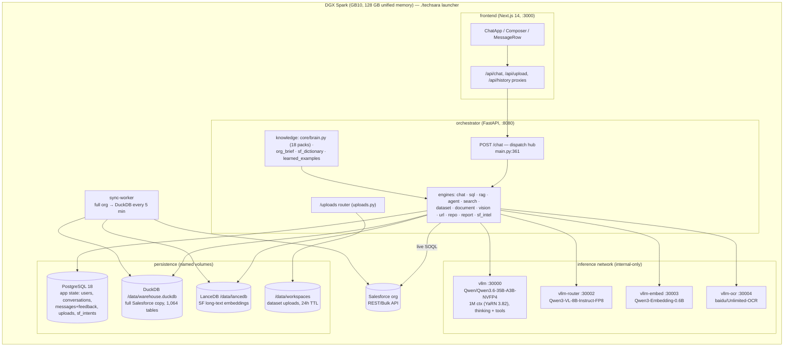

# Current Architecture — personal-LLM-Chabot (TechSara platform)

Phase 0 recon map, produced 2026-08-19 before any feature work on the
"reasoning modes + code interpreter" mission. Every claim below was read from
the code (file:line cited); the four mission features each get an explicit
"exists / partially exists / missing" verdict with concrete integration
points, because **this repository is not a bare chatbot** — two of the four
phases are substantially built already, and building them again per the
letter of the brief would regress working functionality.

---

## 1. Component map

Dual-node note (2026-08-25): `CLUSTER_MODE=dual` adds a second DGX Spark
holding the other half of the `vllm` main model only (TP=2); every other box
above stays on Node 1 — see [`CLUSTER.md`](CLUSTER.md).

**Run model.** The only supported entrypoint is `./techsara` (pinned uv →
`launcher/techsara_cli` → `docker compose` with `compose.yaml` +
`compose/compose.dgx-spark.yaml`; the root `docker-compose.yml` is a retained
superseded artifact, README.md:344-352). Hardware profile, model paths and
tunables are emitted to `.runtime/generated.env`. Staged startup with health
probes; main model gets one retry at a smaller context (cli.py:748).

**Auth.** None, deliberately: single local user, loopback binding is the
security boundary (auth.py:17-20, README.md:303-324). All rows are still
scoped by `user_id`.

**Persistence.** App state in PostgreSQL (db.py:1-7); the analytics plane is
DuckDB + LanceDB + Parquet on the `sf-local-ai_data` volume; report artifacts
on `reports`; uploads under `/data/workspaces` (24 h TTL, 20 GB quota,
config.py:303-305).

**Tests.** ~1,361 orchestrator + 157 sync-worker + 425 frontend + 273
launcher tests; orchestrator suite needs a reachable PostgreSQL
(tests/conftest.py:20-28) but no GPU/vLLM/network; no CI exists.

**Phase 0 baseline (2026-08-19):** orchestrator suite = 1,359 passed,
**2 pre-existing failures** inherited from commit `05d2286` ("New Updated"):
`test_chart_routes.py::test_direct_sql_route_leaves_an_ordinary_question_unCharted`
and `::test_chart_intent_is_read_from_the_user_not_the_planner_step` — the
recent chart-intent/`grounding_question` change attaches a chart on an
ordinary question. Live stack healthy (all /health checks ok). These two
must be repaired (or their intent re-confirmed) at the start of Phase 1 so
every mission commit lands on green.

## 2. Request lifecycle (`POST /chat`)

1. Frontend `startStream` (streams.ts:349-383) POSTs
   `{messages, session_id, conversation_id, mode, sf_live, model, effort,
   agent, web_search, image/images, pdf, clarification}` to `/api/chat`,
   proxied verbatim to the orchestrator (`ChatRequest`, main.py:224-260).
2. Pre-route gates (main.py:478-871): auto-orchestration classifier
   (orchestrate.decide), web-search gating, recall/URL/repo/document/dataset
   context injection, compaction, Salesforce Intelligence Mode
   (sf_intel.run — may clarify or resolve the request).
3. Dispatch chain (main.py:873-991): document → vision → repo → url → agent →
   search → dataset → assistant-chat → sf_live → LangGraph router graph
   (router.py picks sql | rag | vision | report | chat).
4. Engines call vLLM through `app/llm.py` (OpenAI-compatible client);
   `stream_chat_events` yields `("reasoning", …)` / `("token", …)` pairs
   (llm.py:288-341) — reasoning arrives on `delta.reasoning` /
   `reasoning_content` because the main vLLM runs `--reasoning-parser qwen3`.
5. Events stream to the browser as SSE: `token · reasoning · status · step ·
   research · meta · done · error` (sse.ts:138-235). Exactly one final `meta`
   carries route, sql, data (≤500 rows), chart spec, citations, report files,
   steps, folded reasoning (types.ts:124-202). Unknown event kinds are
   dropped safely (sse.ts:233-234) — the extension point for new events.
6. Answers persist via `/history` (PostgreSQL); thumbs feed
   `learned_examples` (👍 SQL becomes few-shots; 👎 disqualifies globally).

**Salesforce integration (must not regress).** sync-worker copies the whole
org (~1,024 objects) into DuckDB every 5 min; SQL engine writes one guarded
SELECT grounded by the brain (18 knowledge packs in `brain/packs/`,
org_brief, sf_dictionary hints, learned examples — sql.py:139-176); live
SOQL fallback via core/salesforce.py (guarded, LIMIT ≤200); sf_intel plans
typed SOQL with ONE forced tool call (`submit_plan`, planner.py:218-231).

## 3. vLLM serving — actual vs mission-recommended flags

Main service (compose/compose.dgx-spark.yaml:33-76), served model
`Qwen/Qwen3.6-35B-A3B-NVFP4` (`nvidia/Qwen3.6-35B-A3B-NVFP4`), port 30000:

| Mission recommendation | Current state | Verdict |
|---|---|---|
| `--reasoning-parser qwen3` | **already set** (`compose.dgx-spark.yaml`) | ✅ keep |
| `--enable-auto-tool-choice` | **already set** (`compose.dgx-spark.yaml`) | ✅ keep |
| `--enable-prefix-caching` | **already set** (`compose.dgx-spark.yaml`) | ✅ keep |
| `--max-model-len 262144` | compose default 262,144; production serves **1,000,000** via `MAIN_MODEL_MAX_LEN` (YaRN ×3.82), needle-verified at 949,915 tokens with `CLUSTER_KV_CACHE_MEMORY_GIB=8` | ✅ keep |
| `--tool-call-parser qwen3_coder` | `qwen3_xml` (`compose.dgx-spark.yaml`) | ❌ **do not change** — qwen3_xml matches Qwen3.6's XML tool template; qwen3_coder would regress tool calling |
| `--gpu-memory-utilization 0.85` | `0.35` (`compose.dgx-spark.yaml`) | ❌ **do not change** — four vLLM services share one unified-memory pool (main .35 + router .17 + embed .04 + OCR .14); 0.85 assumes single-model. Dual mode uses `0.30` per node (`CLUSTER_GPU_MEMORY_UTILIZATION`) because half the weights leave each node and the other services' shares are unchanged — [`CLUSTER.md`](CLUSTER.md#memory) |
| model `Qwen3.6-35B-A3B-FP8` | NVFP4/ModelOpt quant | ❌ **do not change** — FP8 exists in the manifest (nvidia-large profile) but is ~16 GB heavier and tested only to 32k context; NVFP4 is tested at the full 262,144 |

Also already set beyond the brief: `--kv-cache-dtype fp8`,
`--quantization modelopt`, `--attention-backend flashinfer`,
`--enable-chunked-prefill`, `--max-num-batched-tokens 8192`.

**Memory budget for new work** (.runtime/selected-profile.json:119-129):
130.7 GB unified total; ~52.9 GB model runtime; 8 GiB
application_and_report_reserve; 4 GiB docker reserve; ~10.4 GB each OS +
safety reserves. **A code sandbox must fit inside the 8 GiB application
reserve** — the brief's 6 GB per-sandbox × 4 concurrent would blow it;
budget accordingly (see §5.3).

## 4. Feature-by-feature: what exists, what's missing

### 4.1 Reasoning-effort modes — LARGELY EXISTS

Exists today: `effort ∈ {fast, low, medium, high}` end-to-end — ChatRequest
Literal (main.py:248), frontend union + picker + prefs whitelist
(types.ts:38, ModelPicker.tsx:23-45, prefs.ts:64-70). Mechanism:
`chat_template_kwargs.enable_thinking` (llm.py:215-238) — exactly the brief's
lever — on for medium/high, off for fast/low (`wants_thinking`,
llm.py:201-212), gated by a capability registry so non-vLLM backends never
get a 400. Reasoning streams on a separate SSE channel and renders in a
collapsible live "Thinking…" panel (ReasoningAccordion.tsx:39-44) with
persistence into meta. High effort already scales real budgets: output
16,384 vs 8,192 (config.py:182-188), search query/source budgets
(search.py:33-46), agent step/synthesis budgets (agent.py:42-45).

Missing (the actual Phase 1 work):
- **`extra_high` level** — nowhere (backend Literal, llm enums, frontend
  union/picker/sanitize).
- **Thinking token budgets** — none; reasoning shares the answer's
  max_tokens (llm.py:103-110). No `thinking_token_budget` in extra_body, no
  client-side overrun safeguard.
- **Best-of-N + judge** — no `select_best` anywhere; every call reads
  `choices[0]`.
- **Non-streaming reasoning parse** — `chat_completion`/`chat_with_tools`
  discard reasoning entirely (llm.py:130, 451).

Integration points: llm.py:38 + main.py:248 (enum), llm.py:201-238 (mapping
+ budget extra_body), config.py:182-188 + chat.py:80-88 + search.py:33-46 +
agent.py:42-45 (per-effort budget dicts), chat.py:66-105 and llm.py:93-130
(best-of-N insertion), types.ts:38 / ModelPicker.tsx:23 / prefs.ts:64
(frontend).

### 4.2 Agent loop with tool calling — PARTIALLY EXISTS (different shape)

Exists: a LangGraph PLAN → EXECUTE → SYNTHESIZE pipeline (agent.py:741-750)
— one pydantic-validated plan (≤8 steps of kinds
`sql|rag|llm|web|salesforce`), parallel execution (semaphore 3), synthesis;
`step` SSE events render in AgentTimeline. Salesforce is already first-class
(sql/salesforce/rag step kinds hit the warehouse + live org). OpenAI
`tool_calls` are used only by the sf_intel planner as a single forced call
(planner.py:218-231); `llm.chat_with_tools` (llm.py:414-451) already parses
tool_calls against the server-side `qwen3_xml` parser.

Missing vs brief: an *iterative* ReAct loop (observe result → decide next),
a ToolRegistry (dispatch is a hardcoded if/elif, agent.py:298-477),
`role:"tool"` messages with `tool_call_id` round-trips (nowhere in the
codebase), model-driven parallel tool_calls dispatch, a MAX_AGENT_STEPS
*iteration* cap, and richer step events (tool name/args/result).

Decision recorded: build the ReAct loop as a **new engine alongside** the
existing planner (which stays — it serves the report/summary shape well),
sharing `llm.chat_with_tools`; register existing capabilities (sql, live
Salesforce, search, and Phase 3's `execute_code`) in a real ToolRegistry.

### 4.3 Sandboxed code interpreter + file upload — MISSING (the real build)

Code execution today: **none, by explicit design**. No exec/eval of model
output anywhere; the only subprocesses are fixed-argv `git clone`
(repo.py:173-184) and `pandoc` (report.py:102-122). Charts are
Pydantic-validated specs rendered by trusted code (chart_spec.py:189-220,
charts_png.py:71-143) — never model-written matplotlib. The orchestrator has
**no Docker access** (no docker.sock mount, no docker CLI/SDK in the image)
and compose has **zero resource limits anywhere** (no mem_limit/cpus/
pids-limit keys in any compose file).

Upload today: three type-gated paths — images ≤5×10 MB and documents
(.pdf/.docx/.txt/.md ≤25 MB) as base64 in the chat body; datasets
(zip/tar/csv/tsv/parquet/xlsx/json* ≤200 MB) streamed to POST /uploads,
extracted to `/data/workspaces/uploads/<conv>/<upload_id>/` (24 h TTL,
20 GB quota), profiled by trusted DuckDB/openpyxl with network disabled
(profile.py:52-70) — schema summary (shape, dtypes, null %, clipped samples)
is all the model ever sees (dataset.py:5-8), wrapped in untrusted-data
delimiters. So the brief's "auto schema summary + never paste full contents"
discipline already exists — computed host-side, not sandbox-side. Gaps:
arbitrary file types are refused; no per-session execution workspace; no way
to *compute* over data (the dataset prompt explicitly refuses
sums/group-bys, dataset.py:53-58); frontend has no dataset panel, no code
event kind, no assistant-side inline images, and FileCards downloads are
hardwired to `/api/reports/` (FileCards.tsx:18).

What Phase 3 must add (all new): `sandbox/Dockerfile` (Jupyter kernel +
pandas/polars/duckdb stack); a `CodeSandbox` manager (one container per
session: `--network none`, non-root, read-only root, per-session
`/workspace` mount, memory/cpu/pids caps, gVisor if available, exec
timeout, idle reaper); **host Docker access for the orchestrator** (mount
`/var/run/docker.sock` or a socket-proxy sidecar — a deliberate new trust
boundary that must be documented, given the no-auth model); an
`execute_code` tool returning `{stdout, stderr, result, images[], error}`;
upload widening to any-file with sandbox-side introspection for types the
host profiler refuses; the error→retry loop (MAX_CODE_RETRIES); new SSE
event kind(s) + frontend renderer (code card, inline PNG on assistant
messages, generic artifact downloads); and compose resource limits sized to
the 8 GiB application reserve.

### 4.4 Hardening — PARTIALLY EXISTS

Exists: per-call timeouts throughout, upload caps, workspace TTL/quota
sweeps, honest /health with context verification, staged startup, graceful
engine degradation, structured error messages per engine. Missing (Phase 4):
sandbox-specific limits + `MAX_CONCURRENT_SANDBOXES`, idle reaper for
sandboxes, a consolidated docs/CONFIG.md, and any rate limiting beyond web
search's 10/min (config.py:290-292).

## 5. Assumptions & constraints recorded for the build

1. **This repo is the target**: `origin` is
   `github.com/namanjain221995/personal-LLM-Chabot.git`, matching the
   mission; the deployed box is the described DGX Spark (since 2026-08-25
   optionally two of them with `CLUSTER_MODE=dual`, sharing only the main
   model; the application still sees one endpoint — [`CLUSTER.md`](CLUSTER.md)).
2. **The three "recommended flag" divergences stay** (parser, gpu-util,
   model quant) for the reasons in §3 — adopting them verbatim would regress
   a live, tuned deployment. Documented rather than applied.
3. **Sandbox memory**: brief says 6 GB/sandbox, 4 concurrent = 24 GB; the
   box's application reserve is 8 GiB. We will default
   `SANDBOX_MEM_LIMIT=4g`, `MAX_CONCURRENT_SANDBOXES=2` on this profile and
   make both env-tunable, noting the divergence from the brief's defaults.
4. **Effort naming**: the wire already uses `fast|low|medium|high`; the
   brief's `low|medium|high|extra_high` maps onto it as
   low→(existing) low, plus new `extra_high`. `fast` (thinking off,
   router-model unaffected) is preserved — removing it would regress the UI.
5. **No-auth model**: a code sandbox behind an unauthenticated loopback port
   is an RCE-if-published surface; Phase 3 ships with `--network none`,
   caps, and a README warning tied to `TECHSARA_BIND_ADDRESS`.
6. Existing behaviours that must not change: Salesforce brain/grounding
   pipeline, dataset profile-only path for existing suffixes, report/chart
   spec pipeline, clarification flow, history/feedback storage.

## 6. Future state — Phase 3 sandbox topology (approved 2026-08-19, docs only)

Two placement decisions are fixed ahead of the build:

1. **A dedicated `sandbox-manager` service owns Docker.** Only the
   sandbox-manager mounts `/var/run/docker.sock`; the orchestrator NEVER
   gets socket access. Rationale: socket access is root-equivalent on the
   host, and the orchestrator is the internet-adjacent, prompt-injectable,
   unauthenticated surface (auth.py:17-20) — it must not hold host-takeover
   credentials. The orchestrator talks to the sandbox-manager over the
   internal network with a narrow API (`create/exec/upload/reap` per
   session); the manager applies the caps (`--network none`, non-root,
   read-only rootfs, memory/cpus/pids limits, gVisor when available,
   `SANDBOX_EXEC_TIMEOUT`, idle TTL, `MAX_CONCURRENT_SANDBOXES`).
2. **Per-session workspaces are HOST-PATH bind mounts.** Sandbox containers
   are *siblings* (spawned via the host daemon), so a path inside the
   orchestrator's named `data` volume is not mountable into them by its
   container path. A host directory (e.g.
   `${TECHSARA_SANDBOX_ROOT}/<session>/workspace`) is bind-mounted into BOTH
   the sandbox (`/workspace`, rw) and the orchestrator (read-only, for
   upload staging and artifact downloads), making file handoff a plain
   filesystem move with no docker-cp in the hot path. The launcher owns
   creating/reaping these directories alongside its existing
   workspace TTL/quota pattern (uploads.py:8-12).
