# TechSara — Flow Diagrams

Every path a request can take through this system, as a picture. If you read
one file to understand how the project works, read this one.

Diagrams are Mermaid, so they render on GitHub, in most editors, **and in this
chatbot's own UI** — it turns fenced `mermaid` blocks into real, zoomable
diagrams.

> Companion docs: [`README.md`](../README.md) for prose and configuration,
> [`docs/01-codebase/deep-research.md`](01-codebase/deep-research.md) for the
> research engine in depth, [`docs/02-diagrams/`](02-diagrams/) for the
> PlantUML C4/sequence suite.

---

## Contents

1. [The whole system at a glance](#1-the-whole-system-at-a-glance)
2. [The models, and what each one is for](#2-the-models-and-what-each-one-is-for)
3. [How a request picks its engine](#3-how-a-request-picks-its-engine)
4. [Mode 1 — Normal chat](#4-mode-1--normal-chat)
5. [Mode 2 — Web search](#5-mode-2--web-search)
6. [Mode 3 — Deep Research](#6-mode-3--deep-research)
7. [Web search vs Deep Research, side by side](#7-web-search-vs-deep-research-side-by-side)
8. [The site crawler](#8-the-site-crawler)
9. [Web memory: what gets stored and reused](#9-web-memory-what-gets-stored-and-reused)
10. [Citations: how a `[n]` is kept honest](#10-citations-how-a-n-is-kept-honest)
11. [Salesforce](#11-salesforce)
12. [Streaming: what the browser receives](#12-streaming-what-the-browser-receives)
13. [Data stores](#13-data-stores)
14. [Where everything runs](#14-where-everything-runs)

---

## 1. The whole system at a glance

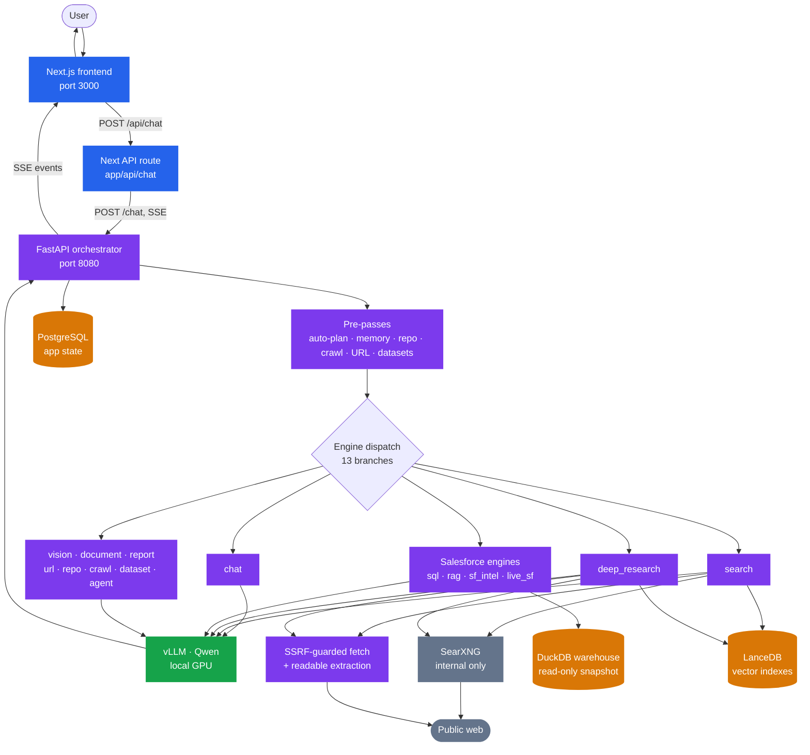

**Nothing leaves the machine except web searches and page fetches**, and both
are off unless enabled. All inference is local.

---

## 2. The models, and what each one is for

Five models run as separate vLLM services on the DGX Spark profile. They are
**not** interchangeable — each is sized for its job.

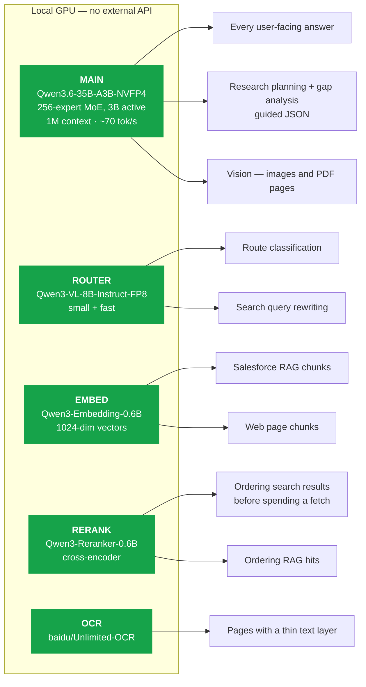

| Role | Model | Port | Why this one |
|---|---|---|---|
| **Main** | `Qwen3.6-35B-A3B-NVFP4` | 8000 | MoE: 35B of quality at 3B-active speed. Measured **70 tok/s** decode, 1M-token window. Answers, plans, and sees images. |
| **Router** | `Qwen3-VL-8B-Instruct-FP8` | 8002 | Classifying a route or rewriting a query is mechanical. Doing it on the main model made every search wait seconds before the first fetch. |
| **Embed** | `Qwen3-Embedding-0.6B` | 8003 | 1024-dim vectors for both the Salesforce corpus and web memory. |
| **Rerank** | `Qwen3-Reranker-0.6B` | 8005 | A **cross-encoder**: scores (query, document) jointly. 40 documents in **52 ms**. |
| **OCR** | `baidu/Unlimited-OCR` | 8004 | Only for PDF pages whose text layer is too thin to read. |

> **The reranker had to be served correctly to work at all.** It was originally
> launched with `--runner pooling` and no conversion, so vLLM loaded it as a
> plain *embedding* model — `Supported tasks: ['embed', 'token_embed']`, no
> `score` task — and `/score` returned cosine similarity instead of relevance.
> Ranking "DGX Spark memory bandwidth" put *Download - NVIDIA* first and the
> real hardware guide 11th of 14. It now runs with `--convert classify` and a
> `Qwen3ForSequenceClassification` override; score spread doubled and the junk
> collapsed. See [CHANGELOG](../CHANGELOG.md) 2026-08-30.

---

## 3. How a request picks its engine

Order matters enormously here — each branch must outrank the ones that would
otherwise swallow it.

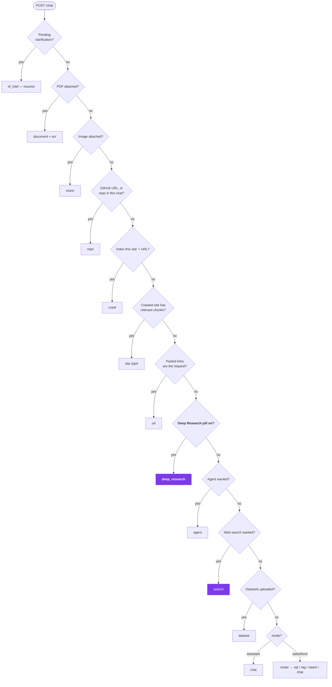

**Why Deep Research sits above the agent.** The auto-planner classifies exactly
the multi-part phrasing Deep Research targets as `agent=true` — and at effort
*Max* with search on, it **forces** it. One branch lower and the pill would be
silently eaten by the planner.

**Why it sits below pasted URLs and the crawler.** A research question that
happens to quote a link should still research; those pre-passes are explicitly
skipped when the pill is on, so the link cannot divert it into the single-page
reader.

---

## 4. Mode 1 — Normal chat

No web, no database. Roughly **9 seconds**.

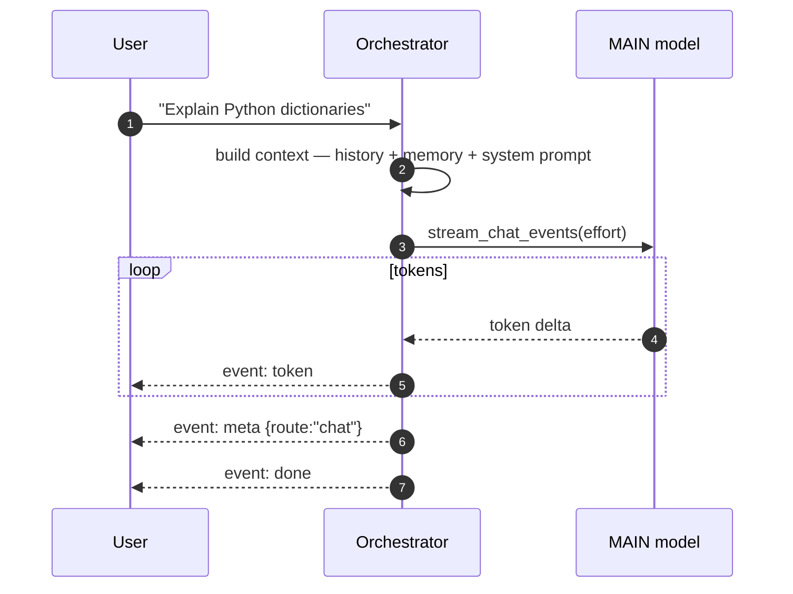

---

## 5. Mode 2 — Web search

One pass: search, read a handful of pages, answer with citations. Roughly
**20 seconds**.

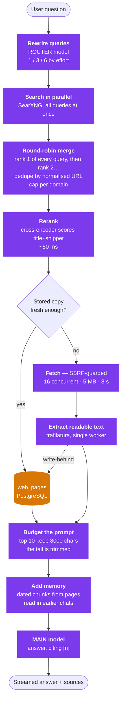

**Graceful degradation is the rule at every step.** One engine 403s → the
others still answer. One URL times out → its snippet is used instead. Search
is entirely unavailable → the model answers from its own knowledge *and says
so*. A dead reranker → engine order is kept. Nothing here can fail the turn.

---

## 6. Mode 3 — Deep Research

The iterative one, rebuilt on 2026-09-03. Plan → search → **open** the
pages → **extract dated claims** → **follow the links** those pages give →
resolve what each subquestion currently has → audit what is missing → search
again → **verify** the important claims → report. Roughly **3–5 minutes**.

```mermaid
flowchart TD
    Q([Research question]) --> T["<b>0 · TEMPORAL FRAME</b><br/>today's date · freshness level<br/>(offline regex, never the router)"]
    T --> PLAN["<b>1 · PLAN</b><br/>MAIN model, guided JSON<br/>→ subquestions · queries (direct,<br/>primary-source, most-recent) · entities"]
    PLAN --> ROUND["<b>2 · ROUND</b>"]

    subgraph ROUNDBOX ["one round"]
        ROUND --> ROUTE["route each query<br/>science pool ↔ general pool"]
        ROUTE --> SEARCH["search in parallel<br/>SearXNG"]
        SEARCH --> SKIP["drop URLs already read<br/>this run"]
        SKIP --> RANK["<b>rank candidates</b><br/>reranker topicality × domain authority<br/>× source class · stale-year snippets down"]
        RANK --> FETCH["fetch + extract<br/>reuses the search pipeline<br/>+ published/updated dates"]
        FETCH --> REG["<b>register sources</b><br/>provenance · fingerprint ·<br/>DUPLICATE? · PRIMARY?"]
        REG --> LINKS["<b>follow links</b><br/>the citation an article gives,<br/>the official page, the PDF"]
        LINKS --> CLAIMS["<b>extract claims</b><br/>MAIN model, guided JSON<br/>claim · value · as_of · current/historical"]
        CLAIMS --> RESOLVE["<b>resolve (code)</b><br/>CURRENT · SUPERSEDED ·<br/>CONFLICTING · UNKNOWN + confidence"]
    end

    RESOLVE --> THIN{"Fewer than<br/>min_sources?"}
    THIN -->|yes| MORE["search the plan's<br/>remaining angles"]
    MORE --> ROUND
    THIN -->|no| AUDIT["<b>3 · AUDIT</b><br/>MAIN model, guided JSON, sees the<br/>evidence-status table + real excerpts<br/>sufficient? · missing? · contradictions? ·<br/>follow-ups · primary-source queries"]

    AUDIT --> STOP{"<b>stop on evidence?</b><br/>sufficient & nothing UNKNOWN ·<br/>no information gain (2 rounds) ·<br/>duplicate rate · budget ·<br/>nowhere left to look"}
    STOP -->|no| FOLLOW["follow-ups + primary-source queries<br/>+ site: queries on authoritative<br/>domains already found"]
    FOLLOW --> ROUND
    STOP -->|yes| VERIFY["<b>4 · VERIFY</b><br/>MAIN model, guided JSON per subquestion<br/>enough? primary opened? newer likely?<br/>disagree? changed over time? confidence"]
    VERIFY -->|low confidence & budget| VROUND["one more targeted round"]
    VROUND --> REPORT
    VERIFY -->|confident| REPORT

    REPORT["<b>5 · REPORT</b><br/>MAIN model, streamed<br/>current date · evidence-status table ·<br/>dated, labelled sources · every claim [n]"]
    REPORT --> VALIDATE["<b>6 · VALIDATE CITATIONS</b><br/>remove any [n] with no source<br/>code blocks left untouched"]
    VALIDATE --> SAVE[("research_runs · <b>web_claims</b><br/>report · registry · dated claims")]
    VALIDATE --> CRAWLQ[("crawl queue<br/>top primary domains")]
    VALIDATE --> OUT([Report + real sources + research summary])

    classDef app fill:#7C3AED,color:#fff,stroke:none
    classDef data fill:#D97706,color:#fff,stroke:none
    class T,PLAN,ROUTE,SEARCH,SKIP,RANK,FETCH,REG,LINKS,CLAIMS,RESOLVE,AUDIT,MORE,FOLLOW,VERIFY,VROUND,REPORT,VALIDATE app
    class SAVE,CRAWLQ data
```

### Time, in one table

| Signal | Where it comes from | What it changes |
|---|---|---|
| today's date + freshness level | the clock; `freshness.classify_offline` | every prompt is dated; a time-sensitive question gets a query with the current year and a recency-weighted resolution |
| a page's published / updated date | `core/provenance.page_dates` (page metadata, JSON-LD, `<time>`, `Last-Modified`) — never invented | the source label the model reads; the ranking; supersession |
| a claim's `as_of` | extracted with the claim (an effective date, event date, or the article's own date) | which value is CURRENT and which is history |

**CURRENT / SUPERSEDED / CONFLICTING / UNKNOWN** are decided *in code*
(`deep_research._resolve`): claims are grouped by value; the best-supported
group wins on recency × authority × independent corroboration; an earlier value
with an earlier date is **superseded** (a change over time), a different value
of comparable date and authority is a **conflict** (surfaced, both cited), and
a subquestion with no claims is **unknown** — which the auditor is told is
*not found yet*, not *does not exist*, until the follow-ups are exhausted.

### When the loop stops

It stops on the **first** of these, and says which (`meta.research_run.stop_reason`,
the Activity panel's *Research summary*, and the `research[…] assess:` log line):

| Stop reason | Meaning | Default |
|---|---|---|
| `sufficient` | the auditor is satisfied and no subquestion is UNKNOWN | — |
| `no_information_gain` | two consecutive rounds added < `DEEP_RESEARCH_MIN_GAIN` of new evidence | `0.15` |
| `duplicate_rate` | a round's pages were mostly copies of pages already read | 70 % |
| `no_new_queries` | the auditor, the primary-source pass and the `site:` fallback produced nothing new | — |
| `iteration_cap` | rounds (verification included) | `DEEP_RESEARCH_MAX_ITERATIONS=5` |
| `source_cap` | pages registered | `DEEP_RESEARCH_MAX_SOURCES=36` |
| `timeout` | wall clock | `DEEP_RESEARCH_TIMEOUT_S=600` |

### What the user watches while it runs

```mermaid
sequenceDiagram
    autonumber
    participant U as Browser
    participant O as Orchestrator

    O-->>U: step "Planning the research" · running
    O-->>U: step "Planned the research" · done + subquestions
    O-->>U: status "Searching the web — 5 queries…"
    O-->>U: research {phase:"query", query, results[]}
    O-->>U: research {phase:"query", query:"↳ links followed from …", results[]}
    O-->>U: status "Extracting claims from 10 source(s)…"
    O-->>U: step "Searching the web" · done — 10 new; 3 links followed; 2 duplicates; 14 claims; 3 primary
    O-->>U: status "Checking what is still missing…"
    O-->>U: step "Analyzed evidence" · done — gaps · not found yet: …
    O-->>U: status "Following up on gaps (round 2)…"
    Note over O,U: …rounds repeat until a stop reason…
    O-->>U: step "Verifying claims" · done — confidence 0.82 (or: one more targeted round)
    O-->>U: status "Writing the report from 28 sources…"
    loop streamed
        O-->>U: token
    end
    O-->>U: step "Wrote the report" · done — 19 of 28 cited · stopped: sufficient · confidence 0.82
    O-->>U: meta {route:"deep_research", sources[] (dated, typed, primary/duplicate flags), research_run{stop_reason, rounds[], resolutions[], …}}
    O-->>U: done
```

No new event types were invented. The SSE vocabulary is **closed** — an unknown
name raises inside the response generator and would kill the stream with no
error frame — so Deep Research reuses `step`, `status`, `research`, `token` and
`meta`, all of which the frontend already renders; the links it follows appear
in the Research panel as their own query group.

### What the log shows

Every decision is one `INFO` line prefixed `research[<id>]`: the plan, each
round's queries, every page **opened** (with its label: class, published,
read, primary, duplicate-of), the links **followed**, the claims extracted,
each subquestion's **resolution**, the auditor's verdict and the **stop
reason**, each verification verdict, and the final summary. `grep research\[`
on the orchestrator log reconstructs a run.

### Concurrency guards

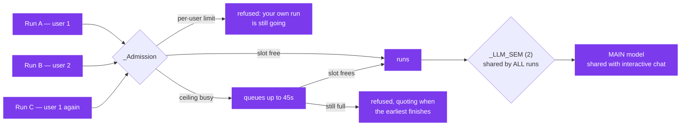

One run at a time per orchestrator process. A second would double every budget
against the same SearXNG and the same GPU, so it is refused rather than both
being starved.

---

## 7. Web search vs Deep Research, side by side

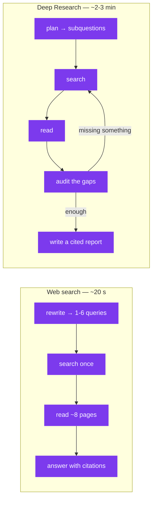

| | Web search | Deep Research |
|---|---|---|
| Searches | 1 round, 1–6 queries | up to 3 rounds, ~5 queries each |
| Pages read | ~8 | up to 24 |
| Model calls | 2 (rewrite + answer) | 5+ (plan, audit per round, report) |
| Knows what it is missing | no | **yes — that is the loop** |
| Output | a paragraph or two | a structured report with sections |
| Fabricated citations | prompt-discouraged | **removed and counted** |
| Turn it on | "Web search" in the **+** menu | "Deep research" in the **+** menu |

Use web search for *a fact*. Use Deep Research for *a decision*.

---

## 8. The site crawler

`index this site <url>` walks one site into the same web store.

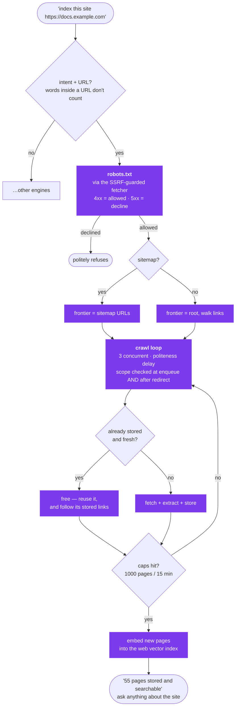

### The background queue (2026-09-03)

The same crawler now also runs **behind** the chat. Two things enqueue a
bounded job (`web_crawls` row, status `queued`, with its own page/minute caps):

* **sharing a URL** — the pasted page is answered from immediately *and* stored
  in the global corpus, and its site is queued (`WEB_SHARE_CRAWL_MAX_PAGES=150`,
  8 min). The status line says *"Indexing docs.example.com in the background —
  later questions can draw on the whole site."* and `meta.site_crawl` records it;
* **a Deep Research run** — its top primary domains (up to 3, 40 pages each).

The knowledge worker drains the queue one job at a time, after its index and
refresh passes, and is **woken** the moment a job is queued (`web_worker.kick()`)
rather than waiting for its five-minute cycle. A restart requeues a background
job that was running; a foreground crawl cut off the same way is closed as
`capped` so its pages stay usable. Same scope, already queued or crawled within
24 h → not queued again; stored pages cost nothing, so a large site finishes over
several shares. Type `/crawl <url>` in the composer for the foreground version
with live progress.

---

## 9. Web memory: what gets stored and reused

Every page the system reads is kept, so the next question is cheaper.

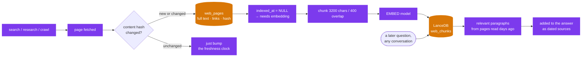

The vector index is **derived state** — deleting it is always safe, because
PostgreSQL rebuilds it from `indexed_at IS NULL`.

---

## 9a. The living knowledge layer (freshness)

**The problem it solves.** The model's weights are frozen at its training
cut-off. On 2026-08-31 it answered *"who's vice president of india"* with the
previous holder — confidently — while 19 pages already stored on this machine
named the current one. The evidence was stored, indexed and retrievable; it was
simply never consulted, because `web_index.retrieve` was only ever called from
inside the search engine. With Web Search off, no code path reached it.

Now every assistant turn runs a cheap pre-answer stage first.

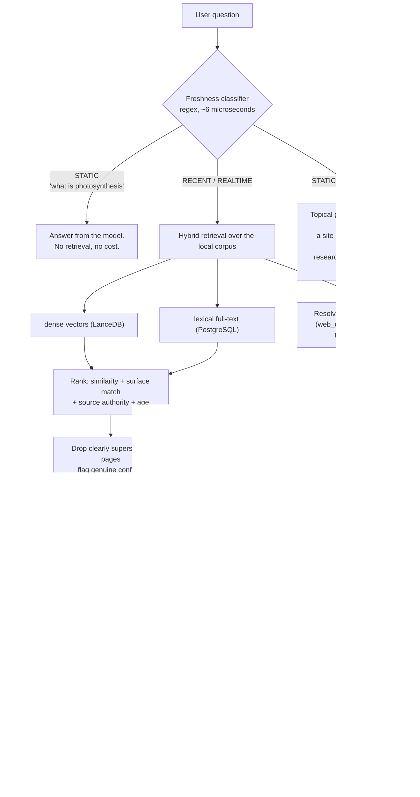

**Why the answer improves for everyone.** The page store is global and public,
so one person's search warms the corpus for the next person's question — which
is what turns a one-off lookup into durable local knowledge. Private material
(who asked, from which conversation, uploads, private URLs) never enters it:
`web_pages` has no `user_id` or `conversation_id` column to leak through.

**Ranking, in plain terms.** Embedding distance alone cannot tell
*"Vice President of India"* from *"Vice President of the United States"* — the
two are nearly the same vector — and it has no opinion at all about whether a
page is from 2025 or 2026. So four signals are combined, weighted by how
volatile the question is:

| Signal | What it catches |
|---|---|
| dense similarity | topical relevance |
| lexical overlap | the exact entity (`india` vs `united states`) |
| source authority | `.gov`/`.nic.in` over a content farm |
| recency | a page read 2 days ago over one read 400 days ago |

For a time-sensitive question, evidence far older than the best available is
**dropped**, not merely ranked lower — handing the model both names and hoping
it picks the newer one is how a confident wrong answer happens. When two
comparably fresh, comparably authoritative sources genuinely disagree, the
prompt says so and the model is told not to feign certainty.

**Keeping it warm.** A background task inside the orchestrator drains the
embedding backlog (which previously only advanced when someone happened to run
a search) and re-reads pages past their TTL, most-retrieved first. Volatility
is inferred from the page — an office-holder page is re-read daily,
documentation every three weeks — and a changed content hash automatically
re-queues the page for embedding. No extra container: the queue is a
PostgreSQL column, so a restart resumes rather than forgets.

---

## 10. Citations: how a `[n]` is kept honest

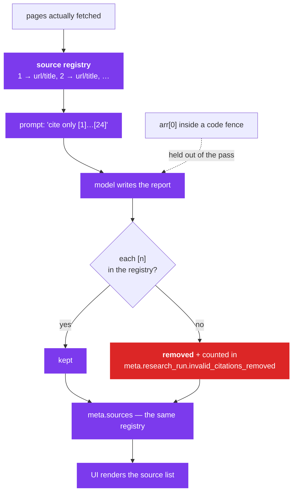

Two things this deliberately does **not** do: it never touches `arr[0]` inside
a code block (that is a subscript, not a citation), and it never reflows the
document — removing a marker takes only its own adjacent space, so YAML
indentation and nested lists survive.

---

## 11. Salesforce

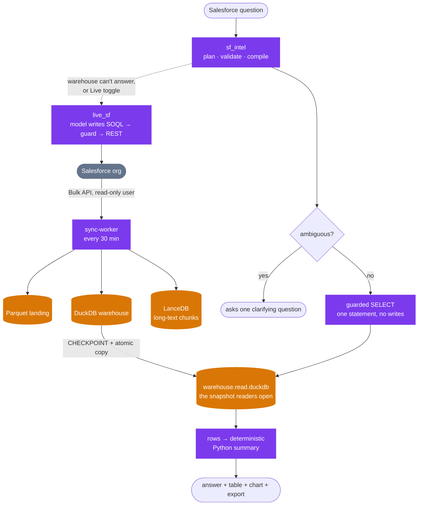

The snapshot exists because DuckDB allows many readers **or** one writer. The
sync worker writes to the live file and publishes an atomic copy; readers only
ever open the copy, which removed the lock failures entirely.

---

## 12. Streaming: what the browser receives

The SSE vocabulary is closed — these eight names and no others.

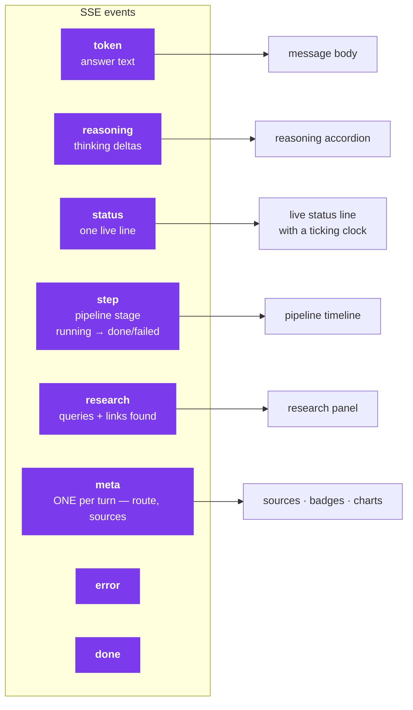

`meta` is special: the frontend **replaces** its local copy wholesale each time,
so exactly one is emitted per turn.

---

## 13. Data stores

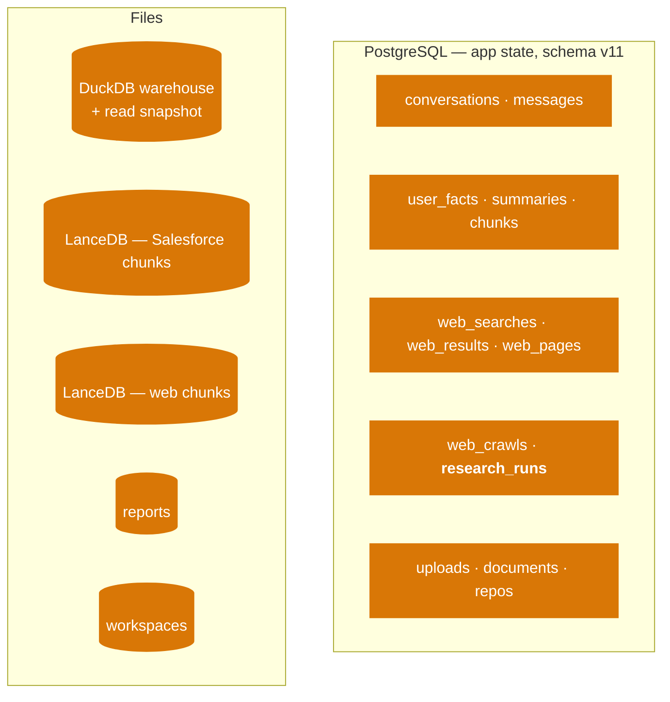

Two **separate** LanceDB directories on purpose: the Salesforce RAG engine
renders every hit from its table as a CRM record citation, so a web page mixed
into it would surface as if it came from Salesforce.

---

## 14. Where everything runs

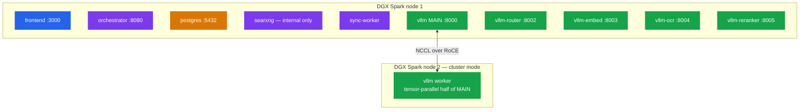

Frontend, orchestrator, PostgreSQL and pgAdmin bind to `127.0.0.1` by default.
SearXNG has **no published port at all** — only the orchestrator reaches it,
over the internal Docker network.

---

## Where to go next

| You want | Read |
|---|---|
| Configuration, ports, quick start | [`README.md`](../README.md) |
| Deep Research in depth — budgets, why each default | [`docs/01-codebase/deep-research.md`](01-codebase/deep-research.md) |
| Why free search engines 403 / 429 / CAPTCHA | [`README.md` §10a](../README.md#10a-three-ways-to-answer-chat-web-search-deep-research) |
| The web search subsystem in code detail | [`docs/01-codebase/orchestrator-search.md`](01-codebase/orchestrator-search.md) |
| Formal C4 / sequence diagrams | [`docs/02-diagrams/`](02-diagrams/) |
| Every change, with its measurements | [`CHANGELOG.md`](../CHANGELOG.md) |
